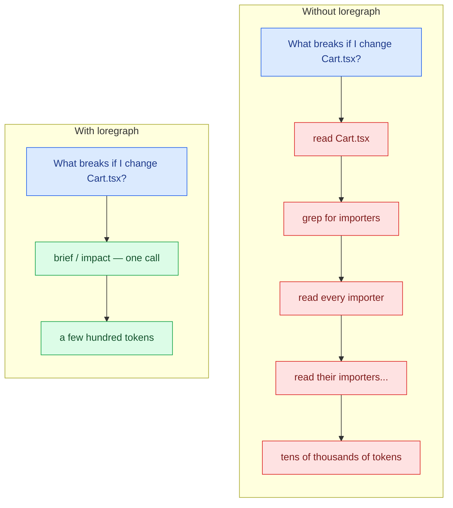
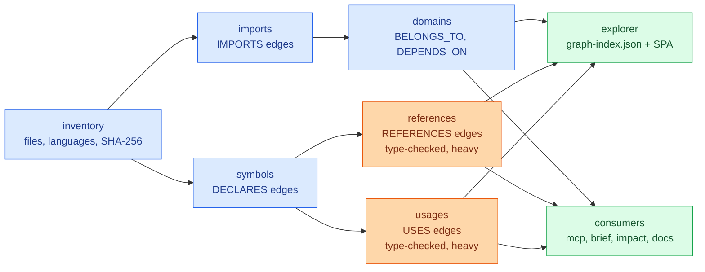
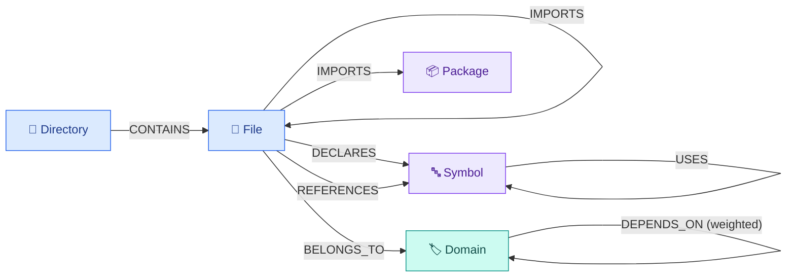
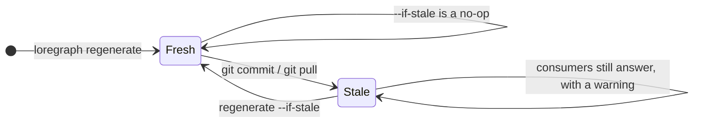

<div align="center">

<picture>
  <source media="(prefers-color-scheme: dark)" srcset="https://raw.githubusercontent.com/zvitaly7/loregraph/main/docs/images/banner-dark.svg">
  
</picture>

<p>
  <a href="https://www.npmjs.com/package/loregraph"></a>
  
  
  <a href="https://github.com/zvitaly7/loregraph/blob/main/LICENSE"></a>
</p>
<p>
  
  
  
</p>

<p><b>English</b> · <a href="https://github.com/zvitaly7/loregraph/blob/main/README.ru.md">Русский</a></p>

<p>
  <a href="#quick-start"><b>Quick start</b></a> ·
  <a href="#commands"><b>Commands</b></a> ·
  <a href="#for-ai-agents"><b>For AI agents</b></a> ·
  <a href="#descriptions"><b>Descriptions</b></a> ·
  <a href="#how-it-works"><b>How it works</b></a> ·
  <a href="#configuration"><b>Configuration</b></a>
</p>

</div>

Builds a deterministic map of a JavaScript/TypeScript codebase — files, symbols, imports, references, domains — then serves it to your browser and to AI agents over MCP.

|  |  |
| :--- | :--- |
| **Install** | `npx loregraph init` |
| **Analyzes** | JavaScript / TypeScript — the inventory layer catalogs any language |
| **Produces** | JSONL graph artifacts, a static explorer SPA, generated Markdown docs |
| **Agent surface** | 16 MCP tools over stdio JSON-RPC 2.0 |
| **Runtime deps** | `typescript` + `ignore`, nothing else |
| **Requires** | Node.js >= 18 |

<a id="what-it-does"></a>

## ✨ What it does

|  |  |
| :--- | :--- |
| 🗺️ **Maps the repo** | Catalogs every file, then resolves imports, top-level declarations, cross-file references and symbol-to-symbol usage into a layered graph. |
| 🏷️ **Groups code into domains** | A semantic overlay derived from the directory layout (configurable), plus weighted `DEPENDS_ON` edges between domains. |
| 🔎 **Shows it in a browser** | One static HTML file plus a JSON index — searchable, offline, no server required beyond an optional local static host. |
| 🤖 **Answers agent questions without opening files** | `brief` and `impact` pack the useful facts about a file, domain, symbol or diff into a few hundred bytes; `outline` gives a file's declarations without the bodies and `show` prints exactly one symbol; an MCP server exposes the same queries as 16 tools. |
| 🧠 **Adds the one thing it cannot prove — labelled as such** | The graph knows what imports what; it cannot know *why* something exists. `describe` asks a model you choose for a short description of each domain, file or symbol and caches it by content hash. Those descriptions are stored, surfaced and serialized as **model-generated**, always naming the model and the date — never merged into the proven facts. |
| 🔄 **Rides along with git** | Every artifact is stamped with the commit it was built from. `--if-stale` turns a rebuild into a no-op while `HEAD` has not moved, `--incremental` re-analyzes only what changed, an opt-in `post-merge` hook keeps the graph in step with `git pull`, and every consumer warns when the cache is behind. |

> [!TIP]
> Because the graph is **derived from the code** rather than written by hand, it cannot drift from it. The freshness machinery is described in [Keeping it fresh](#keeping-it-fresh).

> [!NOTE]
> Analysis scope: the inventory layer catalogs files in **any** language, but import, symbol, reference and usage analysis is **JavaScript/TypeScript only**.

<a id="the-explorer"></a>

## 📸 The explorer

`loregraph explorer --serve` builds a single-file SPA over the graph and opens it on `http://localhost:8765/`.

<div align="center">
  
  <br>
  <sub><i><b>The landing dashboard</b> — repo-wide insight cards computed from the graph: the product map, the biggest domains, the most-used symbols, the dead exports.</i></sub>
</div>

<br>

<div align="center">
  
  <br>
  <sub><i><b>The focus view</b> — one node, what depends on it, and what it depends on.</i></sub>
</div>

<br>

Search covers files, symbols, packages and domains, and every edge type has its own toggle — so the map can be narrowed to just imports, just declarations, or just the dependencies between domains.

<a id="install"></a>

## 🧰 Install & setup

One command sets a project up:

```bash
npx loregraph init
```

It reports what it found in the project, then asks one question per step — Enter accepts the default, `--yes` accepts all of them (and so does a non-interactive shell, e.g. CI):

| Step | What it configures |
| :--- | :--- |
| 📄 `loregraph.config.mjs` | The source roots it detected, with every other knob commented out at its real default. |
| 🙈 `.gitignore` | Ignores the `.kg-cache/` cache directory, unless something already covers it. |
| 🔌 MCP server | A `loregraph` entry in whichever agent config the project already uses — `.mcp.json` (Claude Code), `.cursor/mcp.json` (Cursor), `.vscode/mcp.json` (VS Code). Creates `.mcp.json` when there is none. |
| 📜 npm scripts | `graph` → `loregraph regenerate`, `graph:explore` → `loregraph explorer --serve`. |
| 🪝 git hook (opt-in) | A `post-merge` hook running `loregraph regenerate --if-stale`, so the graph follows your `git pull`. |
| 🏗️ First build | Offers to build the graph there and then. |

> [!IMPORTANT]
> `init` writes into a project it does not own, so it is non-destructive and idempotent: it never overwrites or truncates an existing file (JSON is merged, text is appended to), and a second run changes nothing. Anything that already exists with different content — your own `graph` script, your own `post-merge` hook — is left alone and reported, with the snippet you need printed for you. `--dry-run` shows the exact plan and writes nothing.

Flags: `--yes`, `--dry-run`, `--repo-root PATH`, `--out DIR`, `--hook`, `--build`, `--no-build`.

<a id="quick-start"></a>

## 🚀 Quick start

Published on npm as [`loregraph`](https://www.npmjs.com/package/loregraph):

```bash
npx loregraph init      # set a project up, nothing to install first
npm i -D loregraph      # or add it to the project
npm i -g loregraph      # or install the CLI globally
```

Build the whole graph, then browse it:

```bash
cd /path/to/your-repo
loregraph regenerate
loregraph explorer --serve      # http://localhost:8765/
```

Or point it at another checkout without leaving your own:

```bash
loregraph regenerate --repo-root /path/to/your-repo
```

Ask it things from the terminal:

```bash
loregraph brief src/checkout/Cart.tsx    # a path, a path suffix, a domain or a symbol name
loregraph impact --diff main             # what this branch touches, and which tests to run
```

Serve it to an agent over MCP (stdio JSON-RPC 2.0):

```bash
loregraph mcp --cache /path/to/your-repo/.kg-cache
```

An MCP client entry looks like this:

```json
{
  "mcpServers": {
    "loregraph": {
      "command": "loregraph",
      "args": ["mcp", "--cache", "/path/to/your-repo/.kg-cache"]
    }
  }
}
```

> [!NOTE]
> Working on loregraph itself? Clone the repo, `npm install`, then run `node bin/loregraph.mjs <command>` — or `npm link` once for a global `loregraph` that resolves to your checkout.

> [!WARNING]
> **Very large repos:** the `references` and `usages` layers build a TypeScript program over the whole source set and run the type-checker. If Node runs out of heap, raise it:
>
> ```bash
> NODE_OPTIONS=--max-old-space-size=8192 loregraph regenerate
> ```

<a id="commands"></a>

## 🧩 Commands

Global flags on every command: `--repo-root PATH`, `--out DIR`, `--config FILE`, `--help`.

#### Build the graph

| Command | What it does | Key flags |
| :--- | :--- | :--- |
| `init` | Sets a project up: config file, ignore rule, MCP entry, npm scripts, optional git hook. | `--yes`, `--dry-run`, `--hook`, `--build`, `--no-build` |
| `regenerate` | Runs every layer in dependency order against one repo snapshot. Fail-fast. | `--skip-heavy`, `--skip-explorer`, `--if-stale`, `--force`, `--incremental off\|incremental` |
| `inventory` | Layer 1 — files and directories, with size, language, kind and SHA-256. | `--no-hash`, `--require-vcs`, `--require-clean`, `--project-name NAME` |
| `imports` | Layer 2a — file → file/package `IMPORTS` edges. | `--inventory DIR`, `--require-resolution-rate N`, `--max-files N` |
| `symbols` | Layer 2b — top-level declarations, `DECLARES` edges (parse-only). | `--inventory DIR`, `--max-files N` |
| `references` | Layer 2c — file → symbol `REFERENCES` edges. Uses the type-checker. | `--inventory DIR`, `--symbols DIR`, `--max-files N`, `--incremental off\|incremental` |
| `usages` | Layer 2d — symbol → symbol `USES` edges. Uses the type-checker. | `--inventory DIR`, `--symbols DIR`, `--max-files N`, `--incremental off\|incremental` |
| `domains` | Layer 3 — domain overlay: `Domain` nodes, `BELONGS_TO`, weighted `DEPENDS_ON`. | `--inventory DIR`, `--imports DIR` |

#### Use the graph

| Command | What it does | Key flags |
| :--- | :--- | :--- |
| `brief` | Context pack for one file, domain or symbol. | `<target>`, `--cache DIR`, `--limit N` (10), `--json` |
| `outline` | A file's declarations — kinds, signatures, line ranges, class members — without the bodies. Needs no cache. | `<file>`, `--limit N` (100), `--json` |
| `show` | The source of exactly one symbol, with its JSDoc. Re-parsed at call time, so a stale cache cannot misplace it. | `<symbol>`, `--context N` (0), `--cache DIR`, `--json` |
| `impact` | Blast radius, affected domains, risky exports and likely tests for a change. | `--diff REF` (HEAD), `--files a,b`, `--cache DIR`, `--limit N` (10), `--max-depth N` (25), `--json` |
| `describe` | Cached, model-written descriptions of domains / files / symbols. **The only command that can cost money.** | `--scope domains\|files\|symbols\|all`, `--top N`, `--command CMD`, `--model NAME`, `--dry-run`, `--yes`, `--budget N`, `--budget-tokens N`, `--force`, `--timeout MS`, `--json` |
| `explorer` | Builds `graph-index.json` + the SPA, optionally serves them. | `--cache DIR`, `--serve`, `--port N` (8765) |
| `docs` | Generates `AGENTS.md` and Markdown pages from the graph. | `--cache DIR`, `--out-docs DIR`, `--agents-out FILE`, `--lang en\|ru`, `--force` |
| `mcp` | Starts the stdio MCP server over the cached graph. | `--cache DIR` |

#### Exit codes

| Code | Meaning |
| :---: | :--- |
| `0` | Success. |
| `2` | A usage error or a missing prerequisite — no cache, no upstream artifact. |
| `1` | Anything else that failed: a write, a policy gate, a graph load, or a layer inside `regenerate`. |

<a id="for-ai-agents"></a>

## 🤖 For AI agents (token savings)

> [!TIP]
> An agent asked *"what is this file and what breaks if I change it?"* normally opens the file, then its importers, then their importers. `brief` and `impact` answer from the graph instead. And when the file itself is the point, `outline` and `show` answer from the file — the skeleton, or one symbol, never the whole thing.



<details>
<summary><b>Real captured output — <code>brief</code> and <code>impact</code> on loregraph's own repo</b></summary>

<br>

`loregraph brief src/lib/graph_load.mjs` — real output, captured on loregraph's own repo:

```
FILE src/lib/graph_load.mjs  (JavaScript, code, 5.4 KB)
domain: lib
imports (0 internal): —
packages (2): node:fs, node:path
imported by (12): src/brief/lib/brief.test.mjs, src/brief/run.mjs, src/docs/lib/render.test.mjs, src/docs/run.mjs, src/explorer/run.mjs, src/impact/lib/impact.test.mjs, src/impact/run.mjs, src/lib/graph_load.test.mjs, src/mcp/lib/rpc.test.mjs, src/mcp/lib/tools.test.mjs (+2 more)
blast radius (22): bin/loregraph.mjs, src/brief/lib/brief.test.mjs, src/brief/run.mjs, src/brief/run.test.mjs, src/docs/lib/render.test.mjs, src/docs/run.mjs, src/docs/run.test.mjs, src/explorer/run.mjs, src/explorer/run.test.mjs, src/impact/lib/impact.test.mjs (+12 more)
symbols (5):
  GRAPH_LAYERS variable exported L22 refs=1
  readJsonl function L27 refs=0
  mergeNode function L35 refs=0
  pushInto function L52 refs=0
  loadGraph function exported L64 refs=12
```

`loregraph impact --files src/lib/graph_load.mjs` — same repo:

```
IMPACT  1 changed file(s)  (files)
changed by domain:
  lib (1): src/lib/graph_load.mjs
blast radius (22): bin/loregraph.mjs, src/brief/lib/brief.test.mjs, src/brief/run.mjs, src/brief/run.test.mjs, src/docs/lib/render.test.mjs, src/docs/run.mjs, src/docs/run.test.mjs, src/explorer/run.mjs, src/explorer/run.test.mjs, src/impact/lib/impact.test.mjs (+12 more)
affected domains (10): brief(3), docs(3), impact(3), mcp(3), explorer(2), init(2), lib(2), orchestrate(2), show(2), bin(1)
risky exports (2):
  loadGraph src/lib/graph_load.mjs:64 refs=12 <- src/brief/lib/brief.test.mjs, src/brief/run.mjs, src/docs/lib/render.test.mjs (+9 more)
  GRAPH_LAYERS src/lib/graph_load.mjs:22 refs=1 <- src/lib/graph_load.test.mjs
likely tests (13): src/brief/lib/brief.test.mjs, src/brief/run.test.mjs, src/docs/lib/render.test.mjs, src/docs/run.test.mjs, src/explorer/run.test.mjs, src/impact/lib/impact.test.mjs, src/impact/run.test.mjs, src/init/run.test.mjs, src/lib/graph_load.test.mjs, src/mcp/lib/rpc.test.mjs (+3 more)
```

</details>

<details>
<summary><b>Real captured output — <code>outline</code> and <code>show</code>, the precise-reading pair</b></summary>

<br>

`loregraph outline src/lib/graph_load.mjs` — a 159-line file, understood in seven:

```
OUTLINE src/lib/graph_load.mjs  (159 lines · 5 declarations)
imports (2): node:path, node:fs
  L22-24   export const GRAPH_LAYERS = array  — Every layer merged into the index, in dependency order (later wins on conflict).
  L27-32   function readJsonl(path)  — Read every row of a .jsonl file (blank lines skipped).
  L35-50   function mergeNode(nodesById, node)  — Merge `node` into the index: union labels, later properties override earlier.
  L52-56   function pushInto(map, key, value)
  L64-158  export function loadGraph(cacheDir, { layers = GRAPH_LAYERS } = {})  — Load and index the graph artifacts under `cacheDir`.
```

`loregraph show mergeNode` — one symbol out of that file, JSDoc included. No cache needed, and the range is re-parsed at call time, so it cannot be off by a stale line number:

```
src/lib/graph_load.mjs:34-50  function mergeNode  (17 lines)
34 | /** Merge `node` into the index: union labels, later properties override earlier. */
35 | function mergeNode(nodesById, node) {
36 |   if (!node || typeof node.id !== 'string') return;
37 |   const existing = nodesById.get(node.id);
38 |   if (!existing) {
39 |     nodesById.set(node.id, {
40 |       id: node.id,
41 |       labels: [...(node.labels ?? [])],
42 |       properties: { ...(node.properties ?? {}) },
43 |     });
44 |     return;
45 |   }
46 |   const labels = new Set(existing.labels);
47 |   for (const label of node.labels ?? []) labels.add(label);
48 |   existing.labels = [...labels];
49 |   existing.properties = { ...existing.properties, ...(node.properties ?? {}) };
50 | }
```

A name that is not unique is listed, never guessed — `loregraph show DEFAULT_LIMIT`:

```
ambiguous symbol "DEFAULT_LIMIT" — 3 candidates:
  src/impact/lib/impact.mjs:23  variable DEFAULT_LIMIT
  src/brief/lib/brief.mjs:25  variable DEFAULT_LIMIT
  src/outline/lib/outline.mjs:29  variable DEFAULT_LIMIT
```

`loregraph show outline.mjs#DEFAULT_LIMIT` settles it:

```
src/outline/lib/outline.mjs:28-29  variable DEFAULT_LIMIT  (2 lines)
28 | /** Default cap on the declaration / member / import lists. */
29 | export const DEFAULT_LIMIT = 100;
```

</details>

### 📊 Token savings

There is a reproducible benchmark in [`bench/`](bench/README.md). It needs no model, no API key and no network:

```bash
npm run bench
```

It builds the graph into a temporary cache, then for seven real questions compares the tokens of loregraph's answer against the tokens of an explicit, documented file-reading procedure — counted with **`gpt-tokenizer`** (`o200k_base`), a bench-only devDependency. Not bytes, and not `chars / 4`, which undercuts the real count by 7–9% on these files.

On this repo (145 indexed files, 682 symbols, 126 JS/TS files in the grep universe). The graph build is **2.88 s of wall clock and 0 tokens** — it happens outside the model's context — and is deliberately kept out of the per-question numbers:

| Question | Graph | File-reading baseline | Skim floor | Ratio | |
| :--- | ---: | ---: | ---: | ---: | :--- |
| Blast radius of a file | 448 | 52,747 | 14,162 | **117.7x** | `███████▌` |
| Who references an export | 308 | 25,413 | 6,806 | **82.5x** | `█████` |
| What is this file wired to | 450 | 11,836 | 1,678 | **26.3x** | `█▌` |
| What a module depends on | 183 | 15,579 | 3,271 | **85.1x** | `█████▌` |
| What a file declares (`outline`) | 900 | 6,191 | 445 | **6.9x** | `▌` |
| One symbol's implementation (`show`) | 1,131 | 2,399 | 1,433 | **2.1x** | `▏` |
| Repo-wide dead exports | 1,004 | 188,959 | 55,362 | **188.2x** | `████████████` |
| **Total** | **4,424** | **303,124** | **83,157** | **68.5x** | `████▌` |

> [!IMPORTANT]
> **The baseline is a model of what a file-reading agent would read, not a measurement of one.** Nobody's context window was observed. Four of the seven rows compare answers that are not identical — and not always in the graph's favour. On *what is this file wired to* and *what a module depends on* the graph answers more than the baseline, which is therefore under-charged. On *what a file declares* the **baseline** answers more: the file text carries every body `outline` leaves out, so that row is a claim about navigation, not about understanding. The dead-exports row assumes an agent that reads every file rather than writing a script, so treat it as an upper bound on the naive path. The strictest row is *one symbol's implementation* at 2.1x, where both sides end up with the same text for what was asked. The "skim floor" column charges only the first 40 lines of each file — not a realistic way to answer anything, but a hard lower bound: even there the graph is 18.8x cheaper. Every procedure is written out in [`bench/README.md`](bench/README.md) so it can be argued with.

Separately, and **not** produced by that script: a one-off manual A/B gave two AI agents the same three questions about a 217-file demo project, one with the graph and one without. Both answered the blast-radius and symbol-usage questions identically and correctly, at **51,802 tokens with the graph vs 97,464 without (−47%)**. n = 1; the no-graph agent was unusually efficient (it wrote a TypeScript-compiler script instead of grepping), so a typical agent would likely cost more; and on the dead-exports question the two answers used different definitions (18 vs 44) with the no-graph answer being the more nuanced one. The distance between −47% there and the ratios above is the honest measure of how much a modelled baseline flatters the graph.

### 🔌 MCP server

`loregraph mcp` speaks JSON-RPC 2.0 on stdin/stdout (protocol version `2024-11-05`) and exposes **16 tools**. stdout carries protocol traffic only; diagnostics go to stderr.

<details>
<summary><b>All 16 tools and their arguments</b></summary>

<br>

**Lookup**

| Tool | Arguments |
| :--- | :--- |
| `find_node` | `query` (required), `limit` |
| `node_info` | `id` (required) |
| `list_symbols` | `file` (required) |
| `domain_of` | `file` (required) |

**Traversal**

| Tool | Arguments |
| :--- | :--- |
| `imports_of` | `file` (required) |
| `imported_by` | `file` (required) |
| `impact_of` | `file` (required), `maxDepth` |
| `path_between` | `from`, `to` (both required), `maxDepth` |
| `domain_dependencies` | `domain` (required) |
| `domain_crossings` | — |
| `dead_exports` | `limit` |

**Context packs**

| Tool | Arguments |
| :--- | :--- |
| `brief` | `target` (required), `limit` |
| `outline` | `target` (required), `limit` |
| `show` | `symbol` (required), `context` |
| `impact` | `files`, `diff`, `limit`, `maxDepth` |
| `describe` | `target` (required) — **lookup only, never generates** |

</details>

`brief`, `impact`, `outline` and `show` are the token savers — they call the same pure functions the CLI does. `describe` returns a cached, clearly-labelled model-written description and cannot make a paid call.

<a id="descriptions"></a>

## 🧠 Descriptions — the "what and why" layer

Everything above is a fact static analysis proved. **Intent is not.** `loregraph describe` asks a model for one or two sentences on what a domain, file or symbol *is* and the role it plays, then caches the answer so an agent gets ~30 tokens instead of reading the source.

```bash
# Recommended: reuse a CLI you already pay for. The prompt arrives on its stdin.
loregraph describe --command "your-llm-cli --quiet" --scope domains

loregraph describe --dry-run          # see the estimate, spend nothing
loregraph brief src/checkout/Cart.tsx # the description shows up here, labelled
```

### Bring your own provider

One interface — `describeOne(prompt) -> text` — behind three implementations, resolved in this precedence:

| # | Provider | How it is selected | Notes |
| :--- | :--- | :--- | :--- |
| 1 | **Your own command** | `--command "<shell command>"`, or `describe.command` in the config | loregraph writes the prompt to the process's **stdin** and reads the description from its **stdout**. **The recommended path**: if you already have a CLI or a subscription, use it instead of paying a second time for API tokens. A non-zero exit, empty stdout or a timeout counts as a failure for that one item. |
| 2 | **Anthropic** | `ANTHROPIC_API_KEY` is set | Messages API via `fetch`, no SDK. Default model `claude-opus-5`, override with `--model`. Thinking is switched off — the ask is two sentences. |
| 3 | **OpenAI** | `OPENAI_API_KEY` is set | Chat completions via `fetch`. Default model `gpt-4o-mini`, override with `--model`. |
| — | **none** | nothing configured | Exits **2** with a message naming all three options. It never fails silently and never fabricates a description. |

Adding a fourth is one function plus one row in `resolveProvider` — see [`src/describe/lib/provider.mjs`](src/describe/lib/provider.mjs).

### Honesty: a description is never presented as a fact

This is the point of the whole tool: it doesn't guess. One unlabelled hallucination would poison that, so a generated sentence is marked as generated **everywhere it surfaces**, with the model id and the date:

| Consumer | How it appears |
| :--- | :--- |
| `brief` | A `description (generated by <model> via <provider>, <date>): …` line, after the proven facts. `--json` puts it in its own `description` object with `generated: true`. |
| `docs` | Its own **What the domains are for (model-written)** section in `AGENTS.md` plus a labelled blockquote on each domain page — inside the generated markers, so a re-run replaces it rather than leaving a stale sentence behind. |
| MCP `describe` | Returns `generated: true`, `model`, `provider`, `generatedAt`, a `label`, and a `note` spelling out that it is model-generated and may be wrong or stale. |
| `explorer` | A dashed, italic block in the details panel headed *"Description — written by … , not proven by the graph"*. |

Descriptions live in **their own** JSONL rows and their own map in the explorer index — they are **never merged into a node's `properties`**, precisely so a consumer cannot mistake one for something the graph established. There are dedicated tests asserting exactly that.

### It spends your money, so it never surprises you

```
[loregraph] describe --scope domains
provider:      command
model:         fake-stand-in-v1
to describe:   23 item(s)
in the graph:  domain=23
input tokens:  ~8,455   (estimated at ~4 chars/token)
output tokens: ~4,600  (upper bound: 200/item)
cost:          unknown — no price on record for "fake-stand-in-v1" — set describe.pricing { input, output } (USD per million tokens) in loregraph.config.mjs for a figure
```

- **The estimate is printed before any paid call**, and it asks for confirmation unless `--yes`. On a non-interactive stdin without `--yes` it refuses to spend at all.
- **Cost is quoted only when a price is actually on record** (a small dated table of Anthropic list prices, or your own `describe.pricing`). Otherwise it says `unknown` rather than inventing a number. Quoted figures are **upper bounds**: output is capped per item and most descriptions come in well under it.
- **Token counts are estimates** (`~4 chars/token`) and labelled `~`. There is no tokenizer in the runtime dependencies.
- `--dry-run` prints the estimate and exits, having made **zero calls and written nothing**.
- `--budget N` (items) and `--budget-tokens N` stop cleanly and report what was left undone.
- `--scope domains` is the default: **fewest items, most value per call.** `--top N` keeps only the most important items per kind — domains by file count, files by in-degree, symbols by cross-file reference count — so a huge repo does not cost a fortune by default.

### Incremental by construction

Each row is keyed by the **content hash of the material it was generated from**: the item's graph facts plus the `sha256` the inventory layer already recorded for every contributing file. A re-run re-describes only what actually changed.

```
# first run
[loregraph] described=23 cached=0 failed=0  ~13,055 tokens

# nothing changed
to describe:   0 item(s)  (23 already cached and unchanged — free)
Everything in scope is already described and unchanged. Nothing to do, nothing spent.

# one file touched, then regenerate
to describe:   1 item(s)  (22 already cached and unchanged — free)
[loregraph] described=1 cached=22 failed=0  ~577 tokens
```

### What goes into a prompt

Cheap, already-computed material — **never a file body**:

- the item's graph facts: domain, imports, importers, exported symbols with reference counts, cross-domain weights;
- for files and symbols, the **`outline`** — declarations with signatures and doc lines, bodies omitted. That reuse is itself the saving: describing a 900-line file costs the tokens of about twenty.

The instruction asks for 1–2 sentences, no filler, and tells the model to say what it *cannot* determine rather than guessing. A unit test asserts that a file's body cannot reach the prompt.

Storage is `<cache>/descriptions/{domains,files,symbols}.jsonl`, one row per item:

```json
{"contentHash":"64cb13de…","generatedAt":"2026-08-17T07:15:13.391Z","kind":"domain","model":"fake-stand-in-v1","provider":"command","targetId":"domain:show","text":"…"}
```

> [!NOTE]
> The MCP `describe` tool is **lookup only** — it returns what `loregraph describe` already generated and can never make a paid call on its own. An MCP tool that could spend your money unprompted is not one you should have to trust.

> [!TIP]
> A provider that errors or times out on one item does not abort the run: the failure is recorded, the run continues, and the report names it. Re-running retries only the failures — the successes are cached.

<a id="how-it-works"></a>

## 🏗️ How it works

`regenerate` runs the layers in order, each reading the previous ones from the same cache:



| Layer | What it produces |
| :--- | :--- |
| `inventory` | Every file and directory: path, size, language, kind, trust, SHA-256, plus the VCS revision of the snapshot. |
| `imports` | `IMPORTS` edges from each source to the files and packages it imports, resolved through `tsconfig` `baseUrl`/`paths` when present. |
| `symbols` | `DECLARES` edges from each source to its top-level declarations (parse-only, no type-checking). |
| `domains` | `Domain` nodes, `BELONGS_TO` for every file, and weighted `DEPENDS_ON` edges aggregated from the import graph. |
| `references` | `REFERENCES` edges from a file to the symbols it actually uses. Type-checked — this is a heavy layer. |
| `usages` | `USES` edges from a symbol to the other symbols its body touches. Type-checked — heavy. |
| `explorer` | `graph-index.json` plus the packaged SPA, written side by side under `<cache>/explorer/`. |

### 🕸️ The graph itself



| Edge | From → To | Written by |
| :--- | :--- | :--- |
| `CONTAINS` | Directory → Directory / File | `inventory` |
| `IMPORTS` | File → File / Package | `imports` |
| `DECLARES` | File → Symbol | `symbols` |
| `BELONGS_TO` | File → Domain | `domains` |
| `DEPENDS_ON` | Domain → Domain, weighted | `domains` |
| `REFERENCES` | File → Symbol | `references` |
| `USES` | Symbol → Symbol | `usages` |

Node labels: `Project`, `Snapshot`, `Directory`, `File`, `Package`, `Symbol`, `Domain`.

### 💾 On disk

Artifacts live under the cache dir (`.kg-cache` by default), one directory per layer:

```
.kg-cache/
├── inventory/    nodes.jsonl · edges.jsonl · manifest.json
├── imports/      nodes.jsonl · edges.jsonl · manifest.json
├── symbols/      nodes.jsonl · edges.jsonl · manifest.json
├── domains/      nodes.jsonl · edges.jsonl · manifest.json
├── references/   nodes.jsonl · edges.jsonl · manifest.json
├── usages/       nodes.jsonl · edges.jsonl · manifest.json
└── explorer/     graph-index.json · index.html
```

Every write is atomic (temp file → `fsync` → `rename`) and every row has recursively sorted keys, so the output is byte-for-byte reproducible: two full rebuilds of this repo produced identical artifacts across all twelve node/edge files.

> [!IMPORTANT]
> **No file contents are stored.** The graph holds metadata and relationships only — paths, sizes, hashes, languages, symbol names, line numbers, edges.

> [!NOTE]
> The domain layer is a **heuristic**, not ground truth: by default each first-level directory under a source root becomes a product domain and every other top-level directory becomes an infra bucket. Override it via the `domains` config key when the layout does not match how the team thinks about the code.

<a id="configuration"></a>

## ⚙️ Configuration

Optional `loregraph.config.mjs` (default export) or `loregraph.config.json` at the repo root, or `--config FILE`.

| Key | Default | Meaning |
| :--- | :--- | :--- |
| `srcRoots` | `['src']` | Directories whose first-level subdirectories become product domains. |
| `ignoreFile` | `'.gitignore'` | Ignore file to honor. `.kgignore` is also read when present. |
| `tsconfig` | `null` | Path to a `tsconfig.json`. `null` auto-discovers the nearest one. |
| `vcs` | `'auto'` | `'auto'`, `'git'` or `'none'`. Only git is implemented; anything else behaves as no VCS. |
| `outDir` | `'.kg-cache'` | Base cache directory for all artifacts. |
| `domains` | `null` | `null` auto-derives the overlay. Otherwise an inline object or a path to a module exporting `CANONICAL_DOMAINS`, `ALIASES` and `AREA_BUCKETS`. |
| `incremental` | `'off'` | `'off'` or `'incremental'` — rebuild mode for the heavy layers. |
| `describe` | `{}` | Defaults for `loregraph describe`: `command`, `model`, `scope`, `top`, `timeoutMs`, and `pricing: { input, output }` in USD per million tokens. |

`loregraph docs` additionally reads a `lang` key (`'en'` or `'ru'`, default `'en'`); `--lang` overrides it.

Precedence is **flag → config file → default**. See [`examples/example.domains.config.mjs`](examples/example.domains.config.mjs) for a commented domains override.

```js
// loregraph.config.mjs
export default {
  srcRoots: ['src', 'app/src'],
  outDir: '.kg-cache',
  domains: './loregraph.domains.mjs',
};
```

<a id="keeping-it-fresh"></a>

## 🔄 Keeping it fresh

Every artifact records the revision it was built from. Consumers compare it with the repo's current revision and act on the difference:



```
[loregraph] warning: cache is at 669e8c97d6d6df8e2607d3e4ea867cc497dcbe11, repo is at b4f9bdef9f467cc90ad2a4de9652d7de05f0b4d7 — run `loregraph regenerate`
```

`brief`, `impact`, `docs` and `mcp` warn and keep going — a stale answer beats no answer, as long as you know. `explorer` embeds the same signal in its index so the SPA can flag it. `describe` warns too, and more loudly: writing paid-for descriptions of code that has already moved on is the one case where you probably want to regenerate first.

Rebuild only when it matters:

```bash
loregraph regenerate --if-stale     # skips entirely when the cache matches HEAD
loregraph regenerate --force        # rebuild regardless
```

```
graph up to date at 9a59c993a022a654d03189c2d29f452a30b72059 — skipping
```

`loregraph init --hook` installs a `post-merge` hook that runs exactly that after every `git pull`.

### ⚡ Incremental heavy layers (opt-in)

`--incremental incremental` makes `references` and `usages` reuse cached edges for files whose edges cannot have changed, and re-extract only the affected set — the changed files plus everything that transitively imports them — against a whole-repo program.

> [!IMPORTANT]
> **The output is byte-identical to a full rebuild.** That is the primary correctness gate, covered by four dedicated equality tests (modified declaration, added file, deleted file, no change) and re-verified here: after editing one file in a scratch clone, incremental and full runs produced identical `references/edges.jsonl` and `usages/edges.jsonl`.

Any condition the engine cannot reason about — no prior cache, unknown revision, git unavailable, or a changed file that might inject globals — falls back to a full rebuild with a one-line note on stderr.

Measured on a 103-source scratch clone after a one-line edit:

```
references: incremental — re-extracted 4 file(s), reused 204 cached edge(s)
usages: incremental — re-extracted 4 file(s), reused 256 cached edge(s)
```

| Layer | Full rebuild | Incremental |
| :--- | ---: | ---: |
| `references` | 0.59 s | 0.54 s |
| `usages` | 0.57 s | 0.54 s |

> [!CAUTION]
> Those differences are **within noise at this size**, because building the TypeScript program dominates. The mode is aimed at repos where walking every file is the expensive part; it was not measured on one, so no speedup is claimed here.

<a id="generated-docs"></a>

## 📝 Generated docs

`loregraph docs` renders Markdown from the graph, so the numbers and links cannot drift from the code:

| Output | Contents |
| :--- | :--- |
| `<repo>/AGENTS.md` | Orientation page: file/symbol/domain counts, languages, most-used packages, test count, the domain table — plus a separate, clearly-labelled section of model-written domain descriptions when `loregraph describe` has produced any. |
| `<out-docs>/README.md` | Index of the generated pages. |
| `<out-docs>/domains/<domain>.md` | One page per domain. |
| `<out-docs>/dependencies.md` | Cross-domain map, external packages, biggest importers. |
| `<out-docs>/health.md` | Dead exports and orphan candidates. |

Default locations are `<repo>/AGENTS.md` and `<repo>/docs/loregraph/`; `--agents-out` and `--out-docs` move them. On this repo the run produced 27 pages (`AGENTS.md`, three top-level pages, 23 domain pages).

Hand-written content survives. Everything generated sits between two markers:

```markdown
<!-- loregraph:begin generated -->
...rewritten on every run...
<!-- loregraph:end generated -->
```

- Text **outside** the markers is carried over byte for byte — a paragraph above the block and a section below it both survive regeneration.
- A target file with **no markers at all** is assumed hand-written and is skipped with a warning, so `loregraph docs` can never silently eat someone's `AGENTS.md`. `--force` opts into overwriting it.
- Re-running with no code changes reports `unchanged` for every page and writes nothing.

<a id="requirements"></a>

## 📦 Requirements

- Node.js **>= 18** (`engines.node` in `package.json`). Verified here on Node v22.17.0.
- Runtime dependencies: `typescript` and `ignore`. Nothing else — `vitest` and `gpt-tokenizer` are devDependencies and are not published with the package.

<a id="development"></a>

## 🧪 Development

```bash
npm install
npm test        # vitest run
npm run bench   # the token benchmark, against this repo itself
```

The suite is **778 tests across 65 files**, all passing at the current revision. It includes the incremental equality gate, which asserts that incremental heavy-layer artifacts are byte-identical to a full rebuild.

<a id="publishing"></a>

## 🚢 Publishing

`0.1.0` is live on npm. Releases after it are published by GitHub Actions from [`.github/workflows/publish.yml`](.github/workflows/publish.yml): pushing a `v*` tag installs, runs the suite and publishes to npm. npm never lets a version be republished, so the **next** release needs a version bump first:

```bash
npm version patch                    # 0.1.0 -> 0.1.1, and creates the matching vX.Y.Z tag
git push origin main --follow-tags   # or: git push origin vX.Y.Z
```

- The tag and `package.json` must agree — tag `v1.2.3` ⇔ version `1.2.3`. The workflow checks this first and fails loudly on a mismatch, so bump the version before tagging.
- The repository needs an `NPM_TOKEN` secret (an npm **automation** token with publish rights) under *Settings → Secrets and variables → Actions*.
- The workflow can also be started by hand from the Actions tab (`workflow_dispatch`); manual runs skip the tag check and publish whatever `package.json` says.

<a id="license"></a>

## 📄 License

[MIT](LICENSE) © 2026 Vitaly Zheltko.

<div align="center">
<br>
<sub>Built for repos that outgrew <code>grep</code> — and for agents that should not have to read the whole tree.</sub>
</div>
