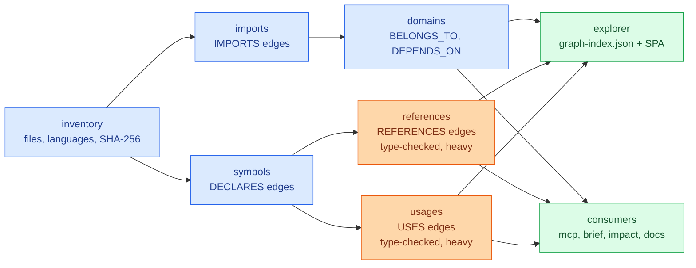

<div align="center">

<h1>loregraph</h1>

<p><b>Deterministic, layered code knowledge graph for any JS/TS repo, with an MCP server for agents.</b></p>

<p><b>English</b> · <a href="README.ru.md">Русский</a></p>

<p>
  
  
  
  
  
  
</p>

</div>

Builds a deterministic map of a JavaScript/TypeScript codebase — files, symbols, imports, references, domains — then serves it to your browser and to AI agents over MCP.

## ✨ What it does

- **Maps the repo.** Catalogs every file, then resolves imports, top-level declarations, cross-file references and symbol-to-symbol usage into a layered graph.
- **Groups code into domains.** A semantic overlay derived from the directory layout (configurable), plus weighted `DEPENDS_ON` edges between domains.
- **Shows it in a browser.** One static HTML file plus a JSON index — searchable, offline, no server required beyond an optional local static host.
- **Answers agent questions without opening files.** `brief` and `impact` pack the useful facts about a file, domain, symbol or diff into a few hundred bytes; an MCP server exposes the same queries as 13 tools.
- **Rides along with git, so it cannot go stale.** Every artifact is stamped with the commit it was built from. `--if-stale` turns a rebuild into a no-op while `HEAD` has not moved; `--incremental` reads `git diff` and re-analyzes only the changed files and whatever imports them — byte-identical to a full rebuild; an opt-in `post-merge` hook keeps the graph in step with `git pull`. Every consumer warns when the cache is behind. And because it is derived from the code rather than written by hand, it cannot drift from it.

> [!NOTE]
> Analysis scope: the inventory layer catalogs files in **any** language, but import, symbol, reference and usage analysis is **JavaScript/TypeScript only**.

## 📸 Screenshots

<div align="center">
  
  <br>
  <sub><i>The landing dashboard — repo-wide insight cards computed from the graph.</i></sub>
</div>

<div align="center">
  
  <br>
  <sub><i>The focus view — one node, what depends on it, and what it depends on.</i></sub>
</div>

## 🧰 Install & setup

One command sets a project up:

```bash
npx loregraph init
```

It reports what it found in the project, then asks one question per step — Enter accepts the default, `--yes` accepts all of them (and so does a non-interactive shell, e.g. CI):

| Step | What it configures |
| :--- | :--- |
| `loregraph.config.mjs` | The source roots it detected, with every other knob commented out at its real default. |
| `.gitignore` | Ignores the `.kg-cache/` cache directory, unless something already covers it. |
| MCP server | A `loregraph` entry in whichever agent config the project already uses — `.mcp.json` (Claude Code), `.cursor/mcp.json` (Cursor), `.vscode/mcp.json` (VS Code). Creates `.mcp.json` when there is none. |
| npm scripts | `graph` → `loregraph regenerate`, `graph:explore` → `loregraph explorer --serve`. |
| git hook (opt-in) | A `post-merge` hook running `loregraph regenerate --if-stale`, so the graph follows your `git pull`. |
| First build | Offers to build the graph there and then. |

> [!IMPORTANT]
> `init` writes into a project it does not own, so it is non-destructive and idempotent: it never overwrites or truncates an existing file (JSON is merged, text is appended to), and a second run changes nothing. Anything that already exists with different content — your own `graph` script, your own `post-merge` hook — is left alone and reported, with the snippet you need printed for you. `--dry-run` shows the exact plan and writes nothing.

Flags: `--yes`, `--dry-run`, `--repo-root PATH`, `--out DIR`, `--hook`, `--build`, `--no-build`.

## 🚀 Quick start

Published on npm as [`loregraph`](https://www.npmjs.com/package/loregraph):

```bash
npx loregraph init      # set a project up, nothing to install first
npm i -D loregraph      # or add it to the project
npm i -g loregraph      # or install the CLI globally
```

Build the whole graph, then browse it:

```bash
cd /path/to/your-repo
loregraph regenerate
loregraph explorer --serve      # http://localhost:8765/
```

Or point it at another checkout without leaving your own:

```bash
loregraph regenerate --repo-root /path/to/your-repo
```

> [!NOTE]
> Working on loregraph itself? Clone the repo, `npm install`, then run `node bin/loregraph.mjs <command>` — or `npm link` once for a global `loregraph` that resolves to your checkout.

Ask it things from the terminal:

```bash
loregraph brief src/checkout/Cart.tsx    # a path, a path suffix, a domain or a symbol name
loregraph impact --diff main             # what this branch touches, and which tests to run
```

Serve it to an agent over MCP (stdio JSON-RPC 2.0):

```bash
loregraph mcp --cache /path/to/your-repo/.kg-cache
```

An MCP client entry looks like this:

```json
{
  "mcpServers": {
    "loregraph": {
      "command": "loregraph",
      "args": ["mcp", "--cache", "/path/to/your-repo/.kg-cache"]
    }
  }
}
```

> [!WARNING]
> Very large repos: the `references` and `usages` layers build a TypeScript program over the whole source set and run the type-checker. If Node runs out of heap, raise it:

```bash
NODE_OPTIONS=--max-old-space-size=8192 loregraph regenerate
```

## 🧩 Commands

Global flags on every command: `--repo-root PATH`, `--out DIR`, `--config FILE`, `--help`.

| Command | What it does | Key flags |
| :--- | :--- | :--- |
| `init` | Sets a project up: config file, ignore rule, MCP entry, npm scripts, optional git hook. | `--yes`, `--dry-run`, `--hook`, `--build`, `--no-build` |
| `regenerate` | Runs every layer in dependency order against one repo snapshot. Fail-fast. | `--skip-heavy`, `--skip-explorer`, `--if-stale`, `--force`, `--incremental off\|incremental` |
| `inventory` | Layer 1 — files and directories, with size, language, kind and SHA-256. | `--no-hash`, `--require-vcs`, `--require-clean`, `--project-name NAME` |
| `imports` | Layer 2a — file → file/package `IMPORTS` edges. | `--inventory DIR`, `--require-resolution-rate N`, `--max-files N` |
| `symbols` | Layer 2b — top-level declarations, `DECLARES` edges (parse-only). | `--inventory DIR`, `--max-files N` |
| `references` | Layer 2c — file → symbol `REFERENCES` edges. Uses the type-checker. | `--inventory DIR`, `--symbols DIR`, `--max-files N`, `--incremental off\|incremental` |
| `usages` | Layer 2d — symbol → symbol `USES` edges. Uses the type-checker. | `--inventory DIR`, `--symbols DIR`, `--max-files N`, `--incremental off\|incremental` |
| `domains` | Layer 3 — domain overlay: `Domain` nodes, `BELONGS_TO`, weighted `DEPENDS_ON`. | `--inventory DIR`, `--imports DIR` |
| `brief` | Context pack for one file, domain or symbol. | `<target>`, `--cache DIR`, `--limit N` (10), `--json` |
| `impact` | Blast radius, affected domains, risky exports and likely tests for a change. | `--diff REF` (HEAD), `--files a,b`, `--cache DIR`, `--limit N` (10), `--max-depth N` (25), `--json` |
| `explorer` | Builds `graph-index.json` + the SPA, optionally serves them. | `--cache DIR`, `--serve`, `--port N` (8765) |
| `docs` | Generates `AGENTS.md` and Markdown pages from the graph. | `--cache DIR`, `--out-docs DIR`, `--agents-out FILE`, `--lang en\|ru`, `--force` |
| `mcp` | Starts the stdio MCP server over the cached graph. | `--cache DIR` |

Exit codes: `0` success, `2` a usage error or a missing prerequisite (no cache, no upstream artifact), `1` anything else that failed — a write, a policy gate, a graph load, or a layer inside `regenerate`.

## 🤖 For AI agents (token savings)

> [!TIP]
> An agent asked "what is this file and what breaks if I change it?" normally opens the file, then its importers, then their importers. `brief` and `impact` answer from the graph instead.

<details>
<summary><b>Real captured output — <code>brief</code> and <code>impact</code> on loregraph's own repo</b></summary>

`loregraph brief src/lib/graph_load.mjs` — real output, captured on loregraph's own repo:

```
FILE src/lib/graph_load.mjs  (JavaScript, code, 5.4 KB)
domain: lib
imports (0 internal): —
packages (2): node:fs, node:path
imported by (11): src/brief/lib/brief.test.mjs, src/brief/run.mjs, src/docs/lib/render.test.mjs, src/docs/run.mjs, src/explorer/run.mjs, src/impact/lib/impact.test.mjs, src/impact/run.mjs, src/lib/graph_load.test.mjs, src/mcp/lib/rpc.test.mjs, src/mcp/lib/tools.test.mjs (+1 more)
blast radius (20): bin/loregraph.mjs, src/brief/lib/brief.test.mjs, src/brief/run.mjs, src/brief/run.test.mjs, src/docs/lib/render.test.mjs, src/docs/run.mjs, src/docs/run.test.mjs, src/explorer/run.mjs, src/explorer/run.test.mjs, src/impact/lib/impact.test.mjs (+10 more)
symbols (5):
  GRAPH_LAYERS variable exported L22 refs=1
  readJsonl function L27 refs=0
  mergeNode function L35 refs=0
  pushInto function L52 refs=0
  loadGraph function exported L64 refs=11
```

`loregraph impact --files src/lib/graph_load.mjs` — same repo:

```
IMPACT  1 changed file(s)  (files)
changed by domain:
  lib (1): src/lib/graph_load.mjs
blast radius (20): bin/loregraph.mjs, src/brief/lib/brief.test.mjs, src/brief/run.mjs, src/brief/run.test.mjs, src/docs/lib/render.test.mjs, src/docs/run.mjs, src/docs/run.test.mjs, src/explorer/run.mjs, src/explorer/run.test.mjs, src/impact/lib/impact.test.mjs (+10 more)
affected domains (9): brief(3), docs(3), impact(3), mcp(3), explorer(2), init(2), lib(2), orchestrate(2), bin(1)
risky exports (2):
  loadGraph src/lib/graph_load.mjs:64 refs=11 <- src/brief/lib/brief.test.mjs, src/brief/run.mjs, src/docs/lib/render.test.mjs (+8 more)
  GRAPH_LAYERS src/lib/graph_load.mjs:22 refs=1 <- src/lib/graph_load.test.mjs
likely tests (12): src/brief/lib/brief.test.mjs, src/brief/run.test.mjs, src/docs/lib/render.test.mjs, src/docs/run.test.mjs, src/explorer/run.test.mjs, src/impact/lib/impact.test.mjs, src/impact/run.test.mjs, src/init/run.test.mjs, src/lib/graph_load.test.mjs, src/mcp/lib/rpc.test.mjs (+2 more)
```

</details>

### Token savings

There is a reproducible benchmark in [`bench/`](bench/README.md). It needs no model, no API key and no network:

```bash
npm run bench
```

It builds the graph into a temporary cache, then for five real questions compares the tokens of loregraph's answer against the tokens of an explicit, documented file-reading procedure — counted with **`gpt-tokenizer`** (`o200k_base`), a bench-only devDependency. Not bytes, and not `chars / 4`, which undercuts the real count by 7–9% on these files.

On this repo (129 indexed files, 598 symbols, 110 JS/TS files in the grep universe). The graph build is **1.92 s of wall clock and 0 tokens** — it happens outside the model's context — and is deliberately kept out of the per-question numbers:

| Question | Graph | File-reading baseline | Skim floor | Ratio |
| :--- | ---: | ---: | ---: | ---: |
| Blast radius of a file | 424 | 49,608 | 13,338 | 117x |
| Who references an export | 281 | 23,764 | 6,427 | 84.6x |
| What is this file wired to | 413 | 10,149 | 1,662 | 24.6x |
| What a module depends on | 175 | 13,892 | 3,255 | 79.4x |
| Repo-wide dead exports | 806 | 167,675 | 49,028 | 208x |
| **Total** | **2,099** | **265,088** | **73,710** | **126.3x** |

> [!IMPORTANT]
> **The baseline is a model of what a file-reading agent would read, not a measurement of one.** Nobody's context window was observed. Two of the five rows compare answers that are not identical, and in both cases the baseline is under-charged. The dead-exports row assumes an agent that reads every file rather than writing a script, so treat it as an upper bound on the naive path. The "skim floor" column charges only the first 40 lines of each file — not a realistic way to answer anything, but a hard lower bound: even there the graph is 35.1x cheaper. Every procedure is written out in [`bench/README.md`](bench/README.md) so it can be argued with.

Separately, and **not** produced by that script: a one-off manual A/B gave two AI agents the same three questions about a 217-file demo project, one with the graph and one without. Both answered the blast-radius and symbol-usage questions identically and correctly, at **51,802 tokens with the graph vs 97,464 without (−47%)**. n = 1; the no-graph agent was unusually efficient (it wrote a TypeScript-compiler script instead of grepping), so a typical agent would likely cost more; and on the dead-exports question the two answers used different definitions (18 vs 44) with the no-graph answer being the more nuanced one. The distance between −47% there and the ratios above is the honest measure of how much a modelled baseline flatters the graph.

### MCP server

`loregraph mcp` speaks JSON-RPC 2.0 on stdin/stdout (protocol version `2024-11-05`) and exposes **13 tools**. stdout carries protocol traffic only; diagnostics go to stderr.

<details>
<summary><b>All 13 tools and their arguments</b></summary>

| Tool | Arguments |
| :--- | :--- |
| `find_node` | `query` (required), `limit` |
| `node_info` | `id` (required) |
| `imports_of` | `file` (required) |
| `imported_by` | `file` (required) |
| `impact_of` | `file` (required), `maxDepth` |
| `path_between` | `from`, `to` (both required), `maxDepth` |
| `list_symbols` | `file` (required) |
| `domain_of` | `file` (required) |
| `domain_dependencies` | `domain` (required) |
| `domain_crossings` | — |
| `dead_exports` | `limit` |
| `brief` | `target` (required), `limit` |
| `impact` | `files`, `diff`, `limit`, `maxDepth` |

</details>

`brief` and `impact` are the token savers — they call the same pure functions the CLI does.

## 🏗️ How it works

`regenerate` runs the layers in order, each reading the previous ones from the same cache:



| Layer | What it produces |
| :--- | :--- |
| `inventory` | Every file and directory: path, size, language, kind, trust, SHA-256, plus the VCS revision of the snapshot. |
| `imports` | `IMPORTS` edges from each source to the files and packages it imports, resolved through `tsconfig` `baseUrl`/`paths` when present. |
| `symbols` | `DECLARES` edges from each source to its top-level declarations (parse-only, no type-checking). |
| `domains` | `Domain` nodes, `BELONGS_TO` for every file, and weighted `DEPENDS_ON` edges aggregated from the import graph. |
| `references` | `REFERENCES` edges from a file to the symbols it actually uses. Type-checked — this is a heavy layer. |
| `usages` | `USES` edges from a symbol to the other symbols its body touches. Type-checked — heavy. |
| `explorer` | `graph-index.json` plus the packaged SPA, written side by side under `<cache>/explorer/`. |

Artifacts live under the cache dir (`.kg-cache` by default), one directory per layer holding `nodes.jsonl`, `edges.jsonl` and `manifest.json`. Every write is atomic (temp file → `fsync` → `rename`) and every row has recursively sorted keys, so the output is byte-for-byte reproducible: two full rebuilds of this repo produced identical artifacts across all twelve node/edge files.

> [!IMPORTANT]
> **No file contents are stored.** The graph holds metadata and relationships only — paths, sizes, hashes, languages, symbol names, line numbers, edges.

> [!NOTE]
> The domain layer is a **heuristic**, not ground truth: by default each first-level directory under a source root becomes a product domain and every other top-level directory becomes an infra bucket. Override it via the `domains` config key when the layout does not match how the team thinks about the code.

## ⚙️ Configuration

Optional `loregraph.config.mjs` (default export) or `loregraph.config.json` at the repo root, or `--config FILE`.

<details>
<summary><b>All configuration keys and defaults</b></summary>

| Key | Default | Meaning |
| :--- | :--- | :--- |
| `srcRoots` | `['src']` | Directories whose first-level subdirectories become product domains. |
| `ignoreFile` | `'.gitignore'` | Ignore file to honor. `.kgignore` is also read when present. |
| `tsconfig` | `null` | Path to a `tsconfig.json`. `null` auto-discovers the nearest one. |
| `vcs` | `'auto'` | `'auto'`, `'git'` or `'none'`. Only git is implemented; anything else behaves as no VCS. |
| `outDir` | `'.kg-cache'` | Base cache directory for all artifacts. |
| `domains` | `null` | `null` auto-derives the overlay. Otherwise an inline object or a path to a module exporting `CANONICAL_DOMAINS`, `ALIASES` and `AREA_BUCKETS`. |
| `incremental` | `'off'` | `'off'` or `'incremental'` — rebuild mode for the heavy layers. |

</details>

`loregraph docs` additionally reads a `lang` key (`'en'` or `'ru'`, default `'en'`); `--lang` overrides it.

Precedence is flag → config file → default. See [`examples/example.domains.config.mjs`](examples/example.domains.config.mjs) for a commented domains override.

```js
// loregraph.config.mjs
export default {
  srcRoots: ['src', 'app/src'],
  outDir: '.kg-cache',
  domains: './loregraph.domains.mjs',
};
```

## 🔄 Keeping it fresh

Every artifact records the revision it was built from. Consumers compare it with the repo's current revision and say so:

```
[loregraph] warning: cache is at 669e8c97d6d6df8e2607d3e4ea867cc497dcbe11, repo is at b4f9bdef9f467cc90ad2a4de9652d7de05f0b4d7 — run `loregraph regenerate`
```

`brief`, `impact`, `docs` and `mcp` warn and keep going — a stale answer beats no answer, as long as you know. `explorer` embeds the same signal in its index so the SPA can flag it.

Rebuild only when it matters:

```bash
loregraph regenerate --if-stale     # skips entirely when the cache matches HEAD
loregraph regenerate --force        # rebuild regardless
```

```
graph up to date at 9a59c993a022a654d03189c2d29f452a30b72059 — skipping
```

`loregraph init --hook` installs a `post-merge` hook that runs exactly that after every `git pull`.

### Incremental heavy layers (opt-in)

`--incremental incremental` makes `references` and `usages` reuse cached edges for files whose edges cannot have changed, and re-extract only the affected set — the changed files plus everything that transitively imports them — against a whole-repo program.

**The output is byte-identical to a full rebuild.** That is the primary correctness gate, covered by four dedicated equality tests (modified declaration, added file, deleted file, no change) and re-verified here: after editing one file in a scratch clone, incremental and full runs produced identical `references/edges.jsonl` and `usages/edges.jsonl`.

Any condition the engine cannot reason about — no prior cache, unknown revision, git unavailable, or a changed file that might inject globals — falls back to a full rebuild with a one-line note on stderr.

Measured on a 103-source scratch clone after a one-line edit:

```
references: incremental — re-extracted 4 file(s), reused 204 cached edge(s)
usages: incremental — re-extracted 4 file(s), reused 256 cached edge(s)
```

Wall clock on that repo was 0.59 s full vs 0.54 s incremental for `references` and 0.57 s vs 0.54 s for `usages` — **within noise at this size**, because building the TypeScript program dominates. The mode is aimed at repos where walking every file is the expensive part; it was not measured on one, so no speedup is claimed here.

## 📝 Generated docs

`loregraph docs` renders Markdown from the graph, so the numbers and links cannot drift from the code:

| Output | Contents |
| :--- | :--- |
| `<repo>/AGENTS.md` | Orientation page: file/symbol/domain counts, languages, most-used packages, test count, the domain table. |
| `<out-docs>/README.md` | Index of the generated pages. |
| `<out-docs>/domains/<domain>.md` | One page per domain. |
| `<out-docs>/dependencies.md` | Cross-domain map, external packages, biggest importers. |
| `<out-docs>/health.md` | Dead exports and orphan candidates. |

Default locations are `<repo>/AGENTS.md` and `<repo>/docs/loregraph/`; `--agents-out` and `--out-docs` move them. On this repo the run produced 24 pages (`AGENTS.md`, three top-level pages, 20 domain pages).

Hand-written content survives. Everything generated sits between two markers:

```markdown
<!-- loregraph:begin generated -->
...rewritten on every run...
<!-- loregraph:end generated -->
```

- Text **outside** the markers is carried over byte for byte — a paragraph above the block and a section below it both survive regeneration.
- A target file with **no markers at all** is assumed hand-written and is skipped with a warning, so `loregraph docs` can never silently eat someone's `AGENTS.md`. `--force` opts into overwriting it.
- Re-running with no code changes reports `unchanged` for every page and writes nothing.

## 📦 Requirements

- Node.js **>= 18** (`engines.node` in `package.json`). Verified here on Node v22.17.0.
- Runtime dependencies: `typescript` and `ignore`. Nothing else — `vitest` and `gpt-tokenizer` are devDependencies and are not published with the package.

## 🧪 Development

```bash
npm install
npm test        # vitest run
npm run bench   # the token benchmark, against this repo itself
```

The suite is **589 tests across 53 files**, all passing at the current revision. It includes the incremental equality gate, which asserts that incremental heavy-layer artifacts are byte-identical to a full rebuild.

## 🚢 Publishing

`0.1.0` is live on npm. Releases after it are published by GitHub Actions from [`.github/workflows/publish.yml`](.github/workflows/publish.yml): pushing a `v*` tag installs, runs the suite and publishes to npm. npm never lets a version be republished, so the **next** release needs a version bump first:

```bash
npm version patch                    # 0.1.0 -> 0.1.1, and creates the matching vX.Y.Z tag
git push origin main --follow-tags   # or: git push origin vX.Y.Z
```

- The tag and `package.json` must agree — tag `v1.2.3` ⇔ version `1.2.3`. The workflow checks this first and fails loudly on a mismatch, so bump the version before tagging.
- The repository needs an `NPM_TOKEN` secret (an npm **automation** token with publish rights) under *Settings → Secrets and variables → Actions*.
- The workflow can also be started by hand from the Actions tab (`workflow_dispatch`); manual runs skip the tag check and publish whatever `package.json` says.

## 📄 License

[MIT](LICENSE) © 2026 Vitaly Zheltko.
