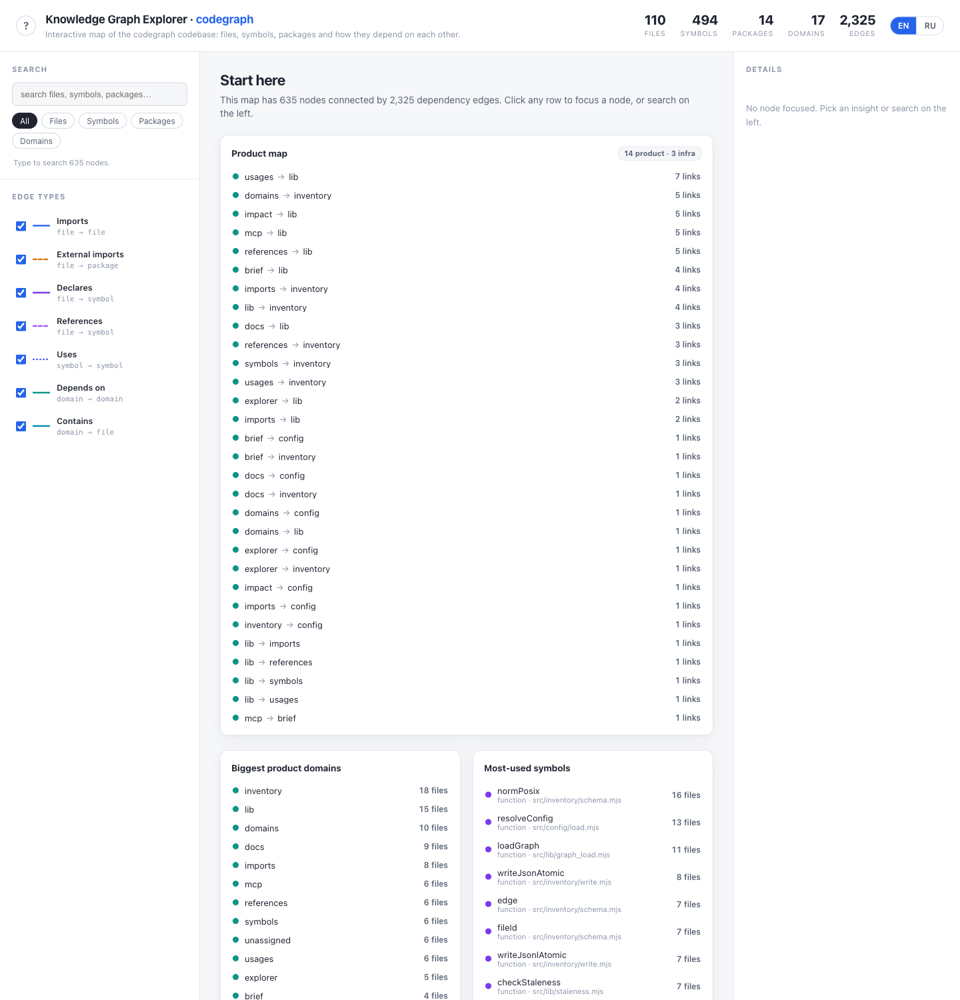
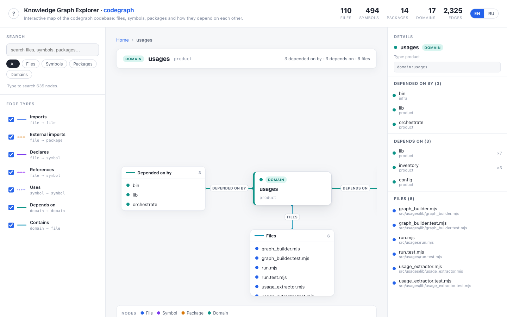
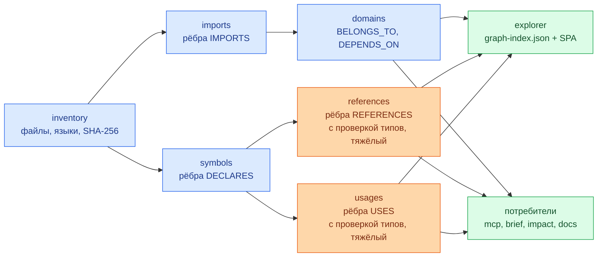

<div align="center">

<h1>loregraph</h1>

<p><b>Детерминированный слоистый граф знаний о коде для любого JS/TS-репозитория, с MCP-сервером для агентов.</b></p>

<p><a href="README.md">English</a> · <b>Русский</b></p>

<p>
  
  
  
  
  
</p>

</div>

Строит детерминированную карту JavaScript/TypeScript-кодовой базы — файлы, символы, импорты, ссылки, домены — и отдаёт её в браузер и AI-агентам по MCP.

## ✨ Что он делает

- **Составляет карту репозитория.** Каталогизирует каждый файл, затем разрешает импорты, объявления верхнего уровня, межфайловые ссылки и связи «символ → символ» в слоистый граф.
- **Группирует код по доменам.** Семантический слой, выводимый из структуры каталогов (настраивается), плюс взвешенные рёбра `DEPENDS_ON` между доменами.
- **Показывает всё в браузере.** Один статический HTML-файл и JSON-индекс — с поиском, офлайн, без сервера (кроме опционального локального раздатчика статики).
- **Отвечает на вопросы агента, не открывая файлы.** `brief` и `impact` упаковывают полезные факты о файле, домене, символе или диффе в несколько сотен байт; MCP-сервер отдаёт те же запросы в виде 13 инструментов.
- **Честно сообщает об устаревании.** Артефакты хранят ревизию, на которой были собраны, и каждый потребитель предупреждает, когда кэш отстал от репозитория.

> [!NOTE]
> Область анализа: слой inventory каталогизирует файлы на **любом** языке, но анализ импортов, символов, ссылок и использований работает **только для JavaScript/TypeScript**.

## 📸 Скриншоты

<div align="center">
  
  <br>
  <sub><i>Стартовый дашборд — карточки инсайтов по всему репозиторию, вычисленные из графа.</i></sub>
</div>

<div align="center">
  
  <br>
  <sub><i>Экран фокуса — один узел, кто зависит от него и от чего зависит он.</i></sub>
</div>

## 🧰 Установка и настройка

Одна команда настраивает проект:

```bash
npx loregraph init
```

Сначала он сообщает, что нашёл в проекте, а затем задаёт по одному вопросу на шаг — Enter принимает значение по умолчанию, `--yes` принимает сразу все (так же ведёт себя неинтерактивная оболочка, например CI):

| Шаг | Что настраивает |
| :--- | :--- |
| `loregraph.config.mjs` | Найденные корни исходников; остальные параметры закомментированы со своими реальными значениями по умолчанию. |
| `.gitignore` | Игнорирует каталог кэша `.kg-cache/`, если он ещё не покрыт правилом. |
| MCP-сервер | Запись `loregraph` в том конфиге агента, который уже есть в проекте, — `.mcp.json` (Claude Code), `.cursor/mcp.json` (Cursor), `.vscode/mcp.json` (VS Code). Если конфига нет, создаёт `.mcp.json`. |
| npm-скрипты | `graph` → `loregraph regenerate`, `graph:explore` → `loregraph explorer --serve`. |
| Git-хук (по желанию) | Хук `post-merge` с `loregraph regenerate --if-stale`, чтобы граф обновлялся после `git pull`. |
| Первая сборка | Предлагает собрать граф сразу же. |

> [!IMPORTANT]
> `init` пишет в чужой проект, поэтому он безопасен и идемпотентен: он никогда не перезаписывает и не обрезает существующий файл (JSON — сливается, текст — дополняется), а второй запуск ничего не меняет. Всё, что уже есть с другим содержимым — ваш собственный скрипт `graph`, ваш собственный хук `post-merge`, — остаётся нетронутым, о нём сообщается, а нужный фрагмент печатается для ручной вставки. `--dry-run` показывает точный план и ничего не пишет.

Флаги: `--yes`, `--dry-run`, `--repo-root PATH`, `--out DIR`, `--hook`, `--build`, `--no-build`.

## 🚀 Быстрый старт

> [!NOTE]
> Начиная с первого релиза по тегу пакет публикуется в npm под именем **`loregraph`** (`npm i -g loregraph`). Пока этот релиз не вышел, используйте его из клона.

```bash
git clone <repo-url> loregraph
cd loregraph
npm install
```

Запуск напрямую:

```bash
node bin/loregraph.mjs regenerate --repo-root /path/to/your-repo --out /path/to/your-repo/.kg-cache
```

Либо один раз слинковать, чтобы получить глобальный бинарник `loregraph`:

```bash
npm link          # в клоне loregraph
loregraph regenerate --repo-root /path/to/your-repo
```

Собрать весь граф и открыть его:

```bash
cd /path/to/your-repo
loregraph regenerate
loregraph explorer --serve      # http://localhost:8765/
```

Спросить что-нибудь из терминала:

```bash
loregraph brief src/checkout/Cart.tsx    # путь, окончание пути, имя домена или имя символа
loregraph impact --diff main             # что затрагивает ветка и какие тесты запускать
```

Отдать граф агенту по MCP (stdio JSON-RPC 2.0):

```bash
loregraph mcp --cache /path/to/your-repo/.kg-cache
```

Запись в конфиге MCP-клиента выглядит так:

```json
{
  "mcpServers": {
    "loregraph": {
      "command": "loregraph",
      "args": ["mcp", "--cache", "/path/to/your-repo/.kg-cache"]
    }
  }
}
```

> [!WARNING]
> Очень большие репозитории: слои `references` и `usages` строят TypeScript-программу по всему набору исходников и запускают проверку типов. Если Node упирается в heap, увеличьте его:

```bash
NODE_OPTIONS=--max-old-space-size=8192 loregraph regenerate
```

## 🧩 Команды

Глобальные флаги для всех команд: `--repo-root PATH`, `--out DIR`, `--config FILE`, `--help`.

| Команда | Что делает | Ключевые флаги |
| :--- | :--- | :--- |
| `init` | Настраивает проект: файл конфигурации, правило игнорирования, запись MCP, npm-скрипты, git-хук по желанию. | `--yes`, `--dry-run`, `--hook`, `--build`, `--no-build` |
| `regenerate` | Запускает все слои в порядке зависимостей на одном снимке репозитория. Останавливается на первой ошибке. | `--skip-heavy`, `--skip-explorer`, `--if-stale`, `--force`, `--incremental off\|incremental` |
| `inventory` | Слой 1 — файлы и каталоги с размером, языком, видом и SHA-256. | `--no-hash`, `--require-vcs`, `--require-clean`, `--project-name NAME` |
| `imports` | Слой 2a — рёбра `IMPORTS` вида «файл → файл/пакет». | `--inventory DIR`, `--require-resolution-rate N`, `--max-files N` |
| `symbols` | Слой 2b — объявления верхнего уровня, рёбра `DECLARES` (только парсинг). | `--inventory DIR`, `--max-files N` |
| `references` | Слой 2c — рёбра `REFERENCES` вида «файл → символ». Использует проверку типов. | `--inventory DIR`, `--symbols DIR`, `--max-files N`, `--incremental off\|incremental` |
| `usages` | Слой 2d — рёбра `USES` вида «символ → символ». Использует проверку типов. | `--inventory DIR`, `--symbols DIR`, `--max-files N`, `--incremental off\|incremental` |
| `domains` | Слой 3 — доменный слой: узлы `Domain`, `BELONGS_TO`, взвешенные `DEPENDS_ON`. | `--inventory DIR`, `--imports DIR` |
| `brief` | Пакет контекста по одному файлу, домену или символу. | `<target>`, `--cache DIR`, `--limit N` (10), `--json` |
| `impact` | Радиус поражения, затронутые домены, рискованные экспорты и вероятные тесты для изменения. | `--diff REF` (HEAD), `--files a,b`, `--cache DIR`, `--limit N` (10), `--max-depth N` (25), `--json` |
| `explorer` | Собирает `graph-index.json` и SPA, при желании раздаёт их. | `--cache DIR`, `--serve`, `--port N` (8765) |
| `docs` | Генерирует `AGENTS.md` и Markdown-страницы из графа. | `--cache DIR`, `--out-docs DIR`, `--agents-out FILE`, `--lang en\|ru`, `--force` |
| `mcp` | Запускает stdio MCP-сервер поверх кэшированного графа. | `--cache DIR` |

Коды возврата: `0` — успех, `2` — ошибка использования либо отсутствие предпосылки (нет кэша, нет артефакта предыдущего слоя), `1` — всё остальное, что не удалось: запись, проверка политики, загрузка графа или слой внутри `regenerate`.

## 🤖 Для AI-агентов (экономия токенов)

> [!TIP]
> Агент, которому задали вопрос «что это за файл и что сломается, если я его изменю?», обычно открывает файл, затем его импортёров, затем их импортёров. `brief` и `impact` отвечают из графа.

<details>
<summary><b>Реальный снятый вывод — <code>brief</code> и <code>impact</code> на собственном репозитории loregraph</b></summary>

`loregraph brief src/lib/graph_load.mjs` — реальный вывод, снятый на собственном репозитории loregraph:

```
FILE src/lib/graph_load.mjs  (JavaScript, code, 5.4 KB)
domain: lib
imports (0 internal): —
packages (2): node:fs, node:path
imported by (11): src/brief/lib/brief.test.mjs, src/brief/run.mjs, src/docs/lib/render.test.mjs, src/docs/run.mjs, src/explorer/run.mjs, src/impact/lib/impact.test.mjs, src/impact/run.mjs, src/lib/graph_load.test.mjs, src/mcp/lib/rpc.test.mjs, src/mcp/lib/tools.test.mjs (+1 more)
blast radius (18): bin/loregraph.mjs, src/brief/lib/brief.test.mjs, src/brief/run.mjs, src/brief/run.test.mjs, src/docs/lib/render.test.mjs, src/docs/run.mjs, src/docs/run.test.mjs, src/explorer/run.mjs, src/explorer/run.test.mjs, src/impact/lib/impact.test.mjs (+8 more)
symbols (5):
  GRAPH_LAYERS variable exported L22 refs=1
  readJsonl function L27 refs=0
  mergeNode function L35 refs=0
  pushInto function L52 refs=0
  loadGraph function exported L64 refs=11
```

`loregraph impact --files src/lib/graph_load.mjs` — тот же репозиторий:

```
IMPACT  1 changed file(s)  (files)
changed by domain:
  lib (1): src/lib/graph_load.mjs
blast radius (18): bin/loregraph.mjs, src/brief/lib/brief.test.mjs, src/brief/run.mjs, src/brief/run.test.mjs, src/docs/lib/render.test.mjs, src/docs/run.mjs, src/docs/run.test.mjs, src/explorer/run.mjs, src/explorer/run.test.mjs, src/impact/lib/impact.test.mjs (+8 more)
affected domains (8): brief(3), docs(3), impact(3), mcp(3), explorer(2), lib(2), orchestrate(2), bin(1)
risky exports (2):
  loadGraph src/lib/graph_load.mjs:64 refs=11 <- src/brief/lib/brief.test.mjs, src/brief/run.mjs, src/docs/lib/render.test.mjs (+8 more)
  GRAPH_LAYERS src/lib/graph_load.mjs:22 refs=1 <- src/lib/graph_load.test.mjs
likely tests (11): src/brief/lib/brief.test.mjs, src/brief/run.test.mjs, src/docs/lib/render.test.mjs, src/docs/run.test.mjs, src/explorer/run.test.mjs, src/impact/lib/impact.test.mjs, src/impact/run.test.mjs, src/lib/graph_load.test.mjs, src/mcp/lib/rpc.test.mjs, src/mcp/lib/tools.test.mjs (+1 more)
```

</details>

### Измеренное сравнение объёма

Измерено в этом репозитории, на собственном дереве исходников loregraph (107 файлов, 100 JS/TS-исходников), по количеству байт ровно тех выводов, что приведены выше:

| Вопрос | Вывод loregraph | Чтение файлов вместо этого | Разница |
| :--- | :--- | :--- | :--- |
| «Что такое `graph_load.mjs` и кто его использует?» | `brief`, **874 Б** | сам файл и 11 его прямых импортёров = **86 233 Б** | примерно на 99 % меньше |
| «Что сломается, если я его изменю, и что запускать?» | `impact`, **1001 Б** | сам файл и 18 файлов радиуса поражения = **136 384 Б** | примерно на 99 % меньше |

Сравниваются байты, а не токены, и предполагается, что иначе агент прочитал бы эти файлы целиком. Это одно измерение на одном репозитории — воспринимайте его как порядок величины, а не как бенчмарк.

### MCP-сервер

`loregraph mcp` говорит на JSON-RPC 2.0 через stdin/stdout (версия протокола `2024-11-05`) и предоставляет **13 инструментов**. В stdout идёт только трафик протокола, диагностика — в stderr.

<details>
<summary><b>Все 13 инструментов и их аргументы</b></summary>

| Инструмент | Аргументы |
| :--- | :--- |
| `find_node` | `query` (обязательный), `limit` |
| `node_info` | `id` (обязательный) |
| `imports_of` | `file` (обязательный) |
| `imported_by` | `file` (обязательный) |
| `impact_of` | `file` (обязательный), `maxDepth` |
| `path_between` | `from`, `to` (оба обязательны), `maxDepth` |
| `list_symbols` | `file` (обязательный) |
| `domain_of` | `file` (обязательный) |
| `domain_dependencies` | `domain` (обязательный) |
| `domain_crossings` | — |
| `dead_exports` | `limit` |
| `brief` | `target` (обязательный), `limit` |
| `impact` | `files`, `diff`, `limit`, `maxDepth` |

</details>

`brief` и `impact` — те самые экономящие токены инструменты: они вызывают ровно те же чистые функции, что и CLI.

## 🏗️ Как это работает

`regenerate` запускает слои по порядку, каждый читает предыдущие из того же кэша:



| Слой | Что производит |
| :--- | :--- |
| `inventory` | Все файлы и каталоги: путь, размер, язык, вид, уровень доверия, SHA-256, а также VCS-ревизию снимка. |
| `imports` | Рёбра `IMPORTS` от каждого исходника к файлам и пакетам, которые он импортирует; разрешаются через `baseUrl`/`paths` из `tsconfig`, если он есть. |
| `symbols` | Рёбра `DECLARES` от каждого исходника к его объявлениям верхнего уровня (только парсинг, без проверки типов). |
| `domains` | Узлы `Domain`, `BELONGS_TO` для каждого файла и взвешенные рёбра `DEPENDS_ON`, агрегированные из графа импортов. |
| `references` | Рёбра `REFERENCES` от файла к символам, которые он действительно использует. С проверкой типов — тяжёлый слой. |
| `usages` | Рёбра `USES` от символа к другим символам, которые затрагивает его тело. С проверкой типов — тяжёлый слой. |
| `explorer` | `graph-index.json` и упакованный SPA, записанные рядом друг с другом в `<cache>/explorer/`. |

Артефакты лежат в каталоге кэша (по умолчанию `.kg-cache`), по одному каталогу на слой, в каждом — `nodes.jsonl`, `edges.jsonl` и `manifest.json`. Каждая запись атомарна (временный файл → `fsync` → `rename`), а ключи в каждой строке рекурсивно отсортированы, поэтому результат воспроизводится побайтово: две полные пересборки этого репозитория дали идентичные артефакты по всем двенадцати файлам узлов и рёбер.

> [!IMPORTANT]
> **Содержимое файлов не сохраняется.** В графе только метаданные и связи — пути, размеры, хеши, языки, имена символов, номера строк, рёбра.

> [!NOTE]
> Доменный слой — это **эвристика**, а не истина в последней инстанции: по умолчанию каждый каталог первого уровня внутри корня исходников становится продуктовым доменом, а каждый другой каталог верхнего уровня — инфраструктурной корзиной. Переопределяйте его ключом конфигурации `domains`, когда раскладка каталогов не совпадает с тем, как команда думает о коде.

## ⚙️ Конфигурация

Необязательный `loregraph.config.mjs` (экспорт по умолчанию) или `loregraph.config.json` в корне репозитория, либо `--config FILE`.

<details>
<summary><b>Все ключи конфигурации и значения по умолчанию</b></summary>

| Ключ | По умолчанию | Значение |
| :--- | :--- | :--- |
| `srcRoots` | `['src']` | Каталоги, чьи подкаталоги первого уровня становятся продуктовыми доменами. |
| `ignoreFile` | `'.gitignore'` | Файл игнорирования, который учитывается. `.kgignore` также читается, если присутствует. |
| `tsconfig` | `null` | Путь к `tsconfig.json`. При `null` ближайший находится автоматически. |
| `vcs` | `'auto'` | `'auto'`, `'git'` или `'none'`. Реализован только git; всё остальное ведёт себя как отсутствие VCS. |
| `outDir` | `'.kg-cache'` | Базовый каталог кэша для всех артефактов. |
| `domains` | `null` | При `null` слой выводится автоматически. Иначе — объект прямо в конфиге или путь к модулю, экспортирующему `CANONICAL_DOMAINS`, `ALIASES` и `AREA_BUCKETS`. |
| `incremental` | `'off'` | `'off'` или `'incremental'` — режим пересборки тяжёлых слоёв. |

</details>

`loregraph docs` дополнительно читает ключ `lang` (`'en'` или `'ru'`, по умолчанию `'en'`); `--lang` его переопределяет.

Приоритет: флаг → файл конфигурации → значение по умолчанию. Прокомментированный пример переопределения доменов — в [`examples/example.domains.config.mjs`](examples/example.domains.config.mjs).

```js
// loregraph.config.mjs
export default {
  srcRoots: ['src', 'app/src'],
  outDir: '.kg-cache',
  domains: './loregraph.domains.mjs',
};
```

## 🔄 Поддержание актуальности

Каждый артефакт хранит ревизию, на которой он был собран. Потребители сравнивают её с текущей ревизией репозитория и сообщают о расхождении:

```
[loregraph] warning: cache is at 669e8c97d6d6df8e2607d3e4ea867cc497dcbe11, repo is at b4f9bdef9f467cc90ad2a4de9652d7de05f0b4d7 — run `loregraph regenerate`
```

`brief`, `impact`, `docs` и `mcp` предупреждают и продолжают работу — устаревший ответ лучше, чем никакого, если вы о нём знаете. `explorer` встраивает тот же признак в свой индекс, чтобы SPA могло его показать.

Пересобирайте только когда это нужно:

```bash
loregraph regenerate --if-stale     # полностью пропускается, если кэш совпадает с HEAD
loregraph regenerate --force        # пересобрать в любом случае
```

```
graph up to date at 9a59c993a022a654d03189c2d29f452a30b72059 — skipping
```

`loregraph init --hook` ставит хук `post-merge`, который выполняет ровно это после каждого `git pull`.

### Инкрементальные тяжёлые слои (по желанию)

`--incremental incremental` заставляет `references` и `usages` переиспользовать кэшированные рёбра для файлов, чьи рёбра измениться не могли, и заново извлекать только затронутое множество — изменённые файлы плюс всё, что транзитивно их импортирует, — на программе по всему репозиторию.

**Результат побайтово идентичен полной пересборке.** Это главный критерий корректности: его покрывают четыре отдельных теста на равенство (изменённое объявление, добавленный файл, удалённый файл, отсутствие изменений), и он перепроверен здесь: после правки одного файла в отдельном клоне инкрементальный и полный прогоны дали идентичные `references/edges.jsonl` и `usages/edges.jsonl`.

Любое условие, о котором движок не может рассуждать — нет предыдущего кэша, ревизия неизвестна, git недоступен или изменённый файл может внедрять глобальные объявления, — приводит к откату на полную пересборку с однострочной пометкой в stderr.

Измерено на отдельном клоне со 103 исходниками после правки в одну строку:

```
references: incremental — re-extracted 4 file(s), reused 204 cached edge(s)
usages: incremental — re-extracted 4 file(s), reused 256 cached edge(s)
```

Реальное время на этом репозитории: 0,59 с при полной сборке против 0,54 с при инкрементальной для `references` и 0,57 с против 0,54 с для `usages` — **в пределах погрешности на таком размере**, потому что основное время уходит на построение TypeScript-программы. Режим рассчитан на репозитории, где обход всех файлов и есть дорогая часть; на таком репозитории замеров не делалось, поэтому никакого ускорения здесь не заявляется.

## 📝 Генерируемая документация

`loregraph docs` рендерит Markdown из графа, поэтому цифры и ссылки не могут разойтись с кодом:

| Файл | Содержимое |
| :--- | :--- |
| `<repo>/AGENTS.md` | Ориентирующая страница: количество файлов, символов и доменов, языки, самые используемые пакеты, число тестов, таблица доменов. |
| `<out-docs>/README.md` | Оглавление сгенерированных страниц. |
| `<out-docs>/domains/<domain>.md` | По одной странице на домен. |
| `<out-docs>/dependencies.md` | Карта междоменных связей, внешние пакеты, крупнейшие импортёры. |
| `<out-docs>/health.md` | Мёртвые экспорты и кандидаты в «сироты». |

По умолчанию пути — `<repo>/AGENTS.md` и `<repo>/docs/loregraph/`; `--agents-out` и `--out-docs` их меняют. На этом репозитории запуск дал 21 страницу (`AGENTS.md`, три страницы верхнего уровня, 17 страниц доменов).

Написанное вручную не теряется. Всё сгенерированное находится между двумя маркерами:

```markdown
<!-- loregraph:begin generated -->
...перезаписывается при каждом запуске...
<!-- loregraph:end generated -->
```

- Текст **вне** маркеров переносится побайтово — и абзац над блоком, и раздел под ним переживают перегенерацию.
- Файл, в котором маркеров **нет вовсе**, считается написанным человеком и пропускается с предупреждением, поэтому `loregraph docs` не может молча съесть чей-то `AGENTS.md`. `--force` явно разрешает перезапись.
- Повторный запуск без изменений в коде отмечает все страницы как `unchanged` и ничего не пишет.

## 📦 Требования

- Node.js **>= 18** (`engines.node` в `package.json`). Здесь проверено на Node v22.17.0.
- Зависимости времени выполнения: `typescript` и `ignore`. Больше ничего.

## 🧪 Разработка

```bash
npm install
npm test        # vitest run
```

Набор тестов — **537 тестов в 51 файле**, все проходят на текущей ревизии. В него входит и проверка равенства для инкрементального режима, которая утверждает, что артефакты тяжёлых слоёв побайтово совпадают с полной пересборкой.

## 🚢 Публикация

Релизы публикует GitHub Actions по файлу [`.github/workflows/publish.yml`](.github/workflows/publish.yml): пуш тега `v*` ставит зависимости, прогоняет тесты и публикует пакет в npm.

```bash
npm version patch                    # поднимает версию в package.json и создаёт соответствующий тег vX.Y.Z
git push origin main --follow-tags   # либо: git push origin vX.Y.Z
```

- Тег и `package.json` должны совпадать — тег `v1.2.3` ⇔ версия `1.2.3`. Workflow проверяет это первым делом и падает с явной ошибкой при расхождении, поэтому сначала поднимайте версию, потом ставьте тег.
- В репозитории должен быть настроен секрет `NPM_TOKEN` (npm-токен типа **automation** с правом публикации) в *Settings → Secrets and variables → Actions*.
- Workflow можно запустить и вручную со вкладки Actions (`workflow_dispatch`); ручной запуск пропускает проверку тега и публикует то, что записано в `package.json`.

## 📄 Лицензия

[MIT](LICENSE) © 2026 Vitaly Zheltko.
