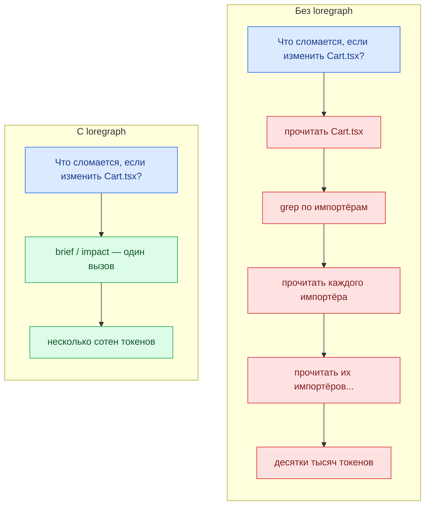
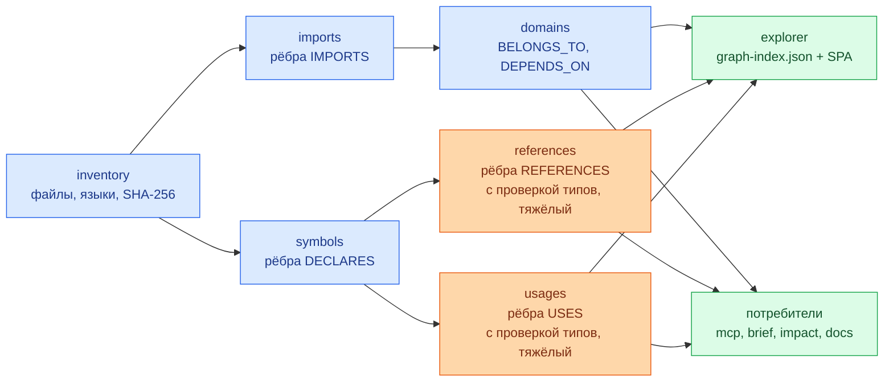
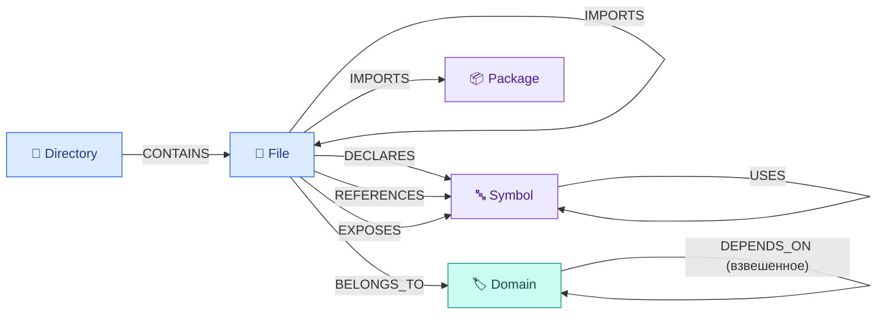
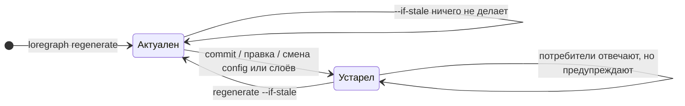

<div align="center">

<picture>
  <source media="(prefers-color-scheme: dark)" srcset="https://raw.githubusercontent.com/zvitaly7/loregraph/main/docs/images/banner-dark-ru.svg">
  
</picture>

<p>
  <a href="https://www.npmjs.com/package/loregraph"></a>
  
  
  <a href="https://github.com/zvitaly7/loregraph/blob/main/LICENSE"></a>
</p>
<p>
  <a href="https://github.com/zvitaly7/loregraph/actions/workflows/test.yml"></a>
  
  
</p>

<p><a href="https://github.com/zvitaly7/loregraph/blob/main/README.md">English</a> · <b>Русский</b></p>

<p>
  <a href="#quick-start"><b>Быстрый старт</b></a> ·
  <a href="#commands"><b>Команды</b></a> ·
  <a href="#for-ai-agents"><b>Для AI-агентов</b></a> ·
  <a href="#descriptions"><b>Описания</b></a> ·
  <a href="#how-it-works"><b>Как это работает</b></a> ·
  <a href="#configuration"><b>Конфигурация</b></a>
</p>

</div>

Строит детерминированную карту JavaScript/TypeScript-кодовой базы — файлы, символы, импорты, ссылки, домены — и отдаёт её в браузер и AI-агентам по MCP.

|  |  |
| :--- | :--- |
| **Установка** | `npx loregraph init` |
| **Анализирует** | JavaScript / TypeScript — слой inventory каталогизирует любой язык |
| **Производит** | JSONL-артефакты графа, статический SPA-обозреватель, генерируемую Markdown-документацию |
| **Интерфейс для агентов** | 17 MCP-инструментов поверх stdio JSON-RPC 2.0 |
| **Зависимости** | `typescript` + `ignore`, больше ничего |
| **Требует** | Node.js >= 18 |

<a id="what-it-does"></a>

## ✨ Что он делает

|  |  |
| :--- | :--- |
| 🗺️ **Составляет карту репозитория** | Каталогизирует каждый файл, затем разрешает импорты, объявления верхнего уровня, межфайловые ссылки и связи «символ → символ» в слоистый граф. |
| 🏷️ **Группирует код по доменам** | Семантический слой, выводимый из структуры каталогов (настраивается), плюс взвешенные рёбра `DEPENDS_ON` между доменами. |
| 🔎 **Показывает всё в браузере** | Один статический HTML-файл и JSON-индекс — с поиском, офлайн, без сервера (кроме опционального локального раздатчика статики). |
| 🤖 **Отвечает на вопросы агента, не открывая файлы** | `brief` и `impact` упаковывают полезные факты о файле, домене, символе или диффе в несколько сотен байт; `outline` показывает объявления файла без тел, а `show` печатает ровно один символ; MCP-сервер отдаёт те же запросы в виде 17 инструментов. |
| 🧠 **Добавляет то, что доказать не может, — и честно это помечает** | Граф знает, что что импортирует, но не знает, *зачем* нечто существует. `describe` просит выбранную вами модель кратко описать каждый домен, файл или символ и кэширует ответ по хешу содержимого. Такие описания хранятся, отображаются и сериализуются как **сгенерированные моделью**, всегда с указанием модели и даты, и никогда не смешиваются с доказанными фактами. |
| 🔄 **Живёт в связке с git** | Каждый артефакт помечен коммитом и контекстом сборки. `--if-stale` ничего не делает, только пока совпадают ревизия, working tree, эффективная конфигурация и запрошенные слои; `--incremental` переанализирует только изменённое, опциональный хук `post-merge` следует за `git pull`, а каждый потребитель предупреждает об отставшем кэше или прерванной сборке. |
| 🚦 **Может уронить сборку** | `loregraph check` превращает граф в CI-гейт: никаких циклических зависимостей, бюджет мёртвых экспортов, порог разрешения импортов и архитектурные границы между доменами. Каждое правило выводится с вердиктом; при нарушении называются конкретные файлы, и команда завершается ненулевым кодом. |

> [!TIP]
> Граф **выводится из кода**, а не пишется руками, поэтому он не может с ним разойтись. Механика актуальности описана в разделе [Поддержание актуальности](#keeping-it-fresh).

> [!NOTE]
> Область анализа: слой inventory каталогизирует файлы на **любом** языке, но анализ импортов, символов, ссылок и использований работает **только для JavaScript/TypeScript**.

<a id="the-explorer"></a>

## 📸 Обозреватель

`loregraph explorer --serve` собирает SPA из одного файла поверх графа и открывает его на `http://localhost:8765/`.

<div align="center">
  
  <br>
  <sub><i><b>Стартовый дашборд</b> — карточки инсайтов по всему репозиторию, вычисленные из графа: карта продукта, крупнейшие домены, самые используемые символы, мёртвые экспорты.</i></sub>
</div>

<br>

<div align="center">
  
  <br>
  <sub><i><b>Экран фокуса</b> — один узел, кто зависит от него и от чего зависит он.</i></sub>
</div>

<br>

Поиск охватывает файлы, символы, пакеты и домены, а у каждого типа рёбер есть свой переключатель — карту можно сузить до одних только импортов, объявлений или связей между доменами.

> [!IMPORTANT]
> Индекс содержит имена всех файлов и символов репозитория, поэтому `--serve` слушает **только `127.0.0.1`**. Чтобы открыть его другим машинам, нужен явный `--host 0.0.0.0` — по умолчанию наружу ничего не отдаётся.

<a id="install"></a>

## 🧰 Установка и настройка

Одна команда настраивает проект:

```bash
npx loregraph init
```

Сначала он сообщает, что нашёл в проекте, а затем задаёт по одному вопросу на шаг — Enter принимает значение по умолчанию, `--yes` принимает сразу все (так же ведёт себя неинтерактивная оболочка, например CI):

| Шаг | Что настраивает |
| :--- | :--- |
| 📄 `loregraph.config.mjs` | Найденные корни исходников; остальные параметры закомментированы со своими реальными значениями по умолчанию. |
| 🙈 `.gitignore` | Игнорирует каталог кэша `.kg-cache/`, если он ещё не покрыт правилом. |
| 🔌 MCP-сервер | Запись `loregraph` в том конфиге агента, который уже есть в проекте, — `.mcp.json` (Claude Code), `.cursor/mcp.json` (Cursor), `.vscode/mcp.json` (VS Code). Если конфига нет, создаёт `.mcp.json`. |
| 📜 npm-скрипты | `graph` → `loregraph regenerate`, `graph:explore` → `loregraph explorer --serve`. |
| 🪝 Git-хук (по желанию) | Хук `post-merge` с `loregraph regenerate --if-stale`, чтобы граф обновлялся после `git pull`. |
| 🏗️ Первая сборка | Предлагает собрать граф сразу же. |
| 🗺️ Межпакетные `paths` | После первой сборки предлагает таблицу `paths` для тех ваших пакетов, до которых сборка не смогла добраться: раскладка читается из индекса, поэтому это один Enter, а не отдельное расследование. |

> [!IMPORTANT]
> `init` пишет в чужой проект, поэтому он безопасен и идемпотентен: он никогда не перезаписывает и не обрезает существующий файл (JSON — сливается, текст — дополняется), а второй запуск ничего не меняет. Всё, что уже есть с другим содержимым — ваш собственный скрипт `graph`, ваш собственный хук `post-merge`, — остаётся нетронутым, о нём сообщается, а нужный фрагмент печатается для ручной вставки. `--dry-run` показывает точный план и ничего не пишет.

Флаги: `--yes`, `--dry-run`, `--repo-root PATH`, `--out DIR`, `--hook`, `--build`, `--no-build`.

<a id="quick-start"></a>

## 🚀 Быстрый старт

Опубликован в npm под именем [`loregraph`](https://www.npmjs.com/package/loregraph):

```bash
npx loregraph init      # настроить проект, ничего предварительно не устанавливая
npm i -D loregraph      # либо добавить в проект
npm i -g loregraph      # либо поставить CLI глобально
```

Собрать весь граф и открыть его:

```bash
cd /path/to/your-repo
loregraph regenerate
loregraph explorer --serve      # http://localhost:8765/
```

Либо направить его на другой чекаут, не уходя из своего:

```bash
loregraph regenerate --repo-root /path/to/your-repo
```

Спросить что-нибудь из терминала:

```bash
loregraph brief src/checkout/Cart.tsx    # путь, окончание пути, имя домена или имя символа
loregraph impact --diff main             # что затрагивает ветка и какие тесты запускать
loregraph cycles                         # циклические зависимости — между файлами и между доменами
```

Поставить это гейтом в CI:

```bash
loregraph check                          # выходит с кодом 1, если нарушено правило из loregraph.config.mjs
```

Отдать граф агенту по MCP (stdio JSON-RPC 2.0):

```bash
loregraph mcp --cache /path/to/your-repo/.kg-cache
```

Запись в конфиге MCP-клиента выглядит так:

```json
{
  "mcpServers": {
    "loregraph": {
      "command": "loregraph",
      "args": ["mcp", "--cache", "/path/to/your-repo/.kg-cache"]
    }
  }
}
```

> [!NOTE]
> Дорабатываете сам loregraph? Склонируйте репозиторий, выполните `npm install` и запускайте `node bin/loregraph.mjs <command>` — либо один раз сделайте `npm link`, чтобы глобальный `loregraph` указывал на ваш чекаут.

> [!WARNING]
> **Очень большие репозитории:** слои `references` и `usages` строят TypeScript-программу по всему набору исходников и запускают проверку типов. Если Node упирается в heap, увеличьте его:
>
> ```bash
> NODE_OPTIONS=--max-old-space-size=8192 loregraph regenerate
> ```

<a id="commands"></a>

## 🧩 Команды

Глобальные флаги для всех команд: `--repo-root PATH`, `--out DIR`, `--config FILE`, `--help`.

#### Собрать граф

| Команда | Что делает | Ключевые флаги |
| :--- | :--- | :--- |
| `init` | Настраивает проект: файл конфигурации, правило игнорирования, запись MCP, npm-скрипты, git-хук по желанию. | `--yes`, `--dry-run`, `--hook`, `--build`, `--no-build` |
| `regenerate` | Запускает все слои в порядке зависимостей на одном снимке репозитория. Останавливается на первой ошибке. | `--skip-heavy`, `--skip-explorer`, `--if-stale`, `--force`, `--incremental off\|incremental` |
| `inventory` | Слой 1 — файлы и каталоги с размером, языком, видом и SHA-256. | `--no-hash`, `--require-vcs`, `--require-clean`, `--project-name NAME` |
| `imports` | Слой 2a — рёбра `IMPORTS` вида «файл → файл/пакет». | `--inventory DIR`, `--require-resolution-rate N`, `--max-files N` |
| `symbols` | Слой 2b — объявления верхнего уровня, рёбра `DECLARES` (только парсинг). | `--inventory DIR`, `--max-files N` |
| `references` | Слой 2c — рёбра `REFERENCES` вида «файл → символ», плюс `EXPOSES` для того, что реэкспортирует точка входа. Использует проверку типов. | `--inventory DIR`, `--symbols DIR`, `--max-files N`, `--incremental off\|incremental` |
| `usages` | Слой 2d — рёбра `USES` вида «символ → символ». Использует проверку типов. | `--inventory DIR`, `--symbols DIR`, `--max-files N`, `--incremental off\|incremental` |
| `domains` | Слой 3 — доменный слой: узлы `Domain`, `BELONGS_TO`, взвешенные `DEPENDS_ON`. | `--inventory DIR`, `--imports DIR` |

#### Использовать граф

| Команда | Что делает | Ключевые флаги |
| :--- | :--- | :--- |
| `brief` | Пакет контекста по одному файлу, домену или символу. | `<target>`, `--cache DIR`, `--limit N` (10), `--max-tokens N`, `--compress-paths`, `--json` |
| `outline` | Объявления файла — виды, сигнатуры, диапазоны строк, члены классов — без тел. Кэш не нужен. | `<file>`, `--limit N` (100), `--max-tokens N`, `--json` |
| `show` | Исходный код ровно одного символа вместе с JSDoc. Файл перечитывается в момент вызова, поэтому устаревший кэш не собьёт диапазон. | `<symbol>`, `--context N` (0), `--cache DIR`, `--json` |
| `impact` | Радиус поражения, затронутые домены, рискованные экспорты и вероятные тесты для изменения. | `--diff REF` (HEAD), `--files a,b`, `--cache DIR`, `--limit N` (10), `--max-depth N` (25), `--max-tokens N`, `--compress-paths`, `--json` |
| `cycles` | Циклические зависимости, найденные алгоритмом Тарьяна (SCC): каждый клубок выводится один раз, доменные циклы — с весами переходов. | `--scope file\|domain\|both` (both), `--cache DIR`, `--limit N` (20), `--json` |
| `check` | **CI-гейт.** Проверяет блок `check` из конфига и завершается ненулевым кодом при нарушении. | `--cache DIR`, `--json` |
| `describe` | Кэшированные описания доменов / файлов / символов, написанные моделью. **Единственная команда, которая может стоить денег.** | `--scope domains\|files\|symbols\|all`, `--top N`, `--command CMD`, `--model NAME`, `--dry-run`, `--yes`, `--budget N`, `--budget-tokens N`, `--force`, `--timeout MS`, `--json` |
| `explorer` | Собирает `graph-index.json` и SPA, при желании раздаёт их. | `--cache DIR`, `--serve`, `--port N` (8765), `--host ADDR` (127.0.0.1) |
| `docs` | Генерирует `AGENTS.md` и Markdown-страницы из графа. | `--cache DIR`, `--out-docs DIR`, `--agents-out FILE`, `--lang en\|ru`, `--force` |
| `mcp` | Запускает stdio MCP-сервер поверх кэшированного графа. | `--cache DIR` |

#### Коды возврата

| Код | Значение |
| :---: | :--- |
| `0` | Успех. |
| `2` | Ошибка использования либо отсутствие предпосылки — нет кэша, нет артефакта предыдущего слоя. |
| `1` | Всё остальное, что не удалось: запись, проверка политики, загрузка графа или слой внутри `regenerate`. |

Для `loregraph check` `1` означает именно **нарушение правила**, а `2` — что вынести вердикт не удалось: неизвестное имя правила, отсутствующий слой графа или отсутствующий кэш.

<a id="for-ai-agents"></a>

## 🤖 Для AI-агентов (экономия токенов)

> [!TIP]
> Агент, которому задали вопрос *«что это за файл и что сломается, если я его изменю?»*, обычно открывает файл, затем его импортёров, затем их импортёров. `brief` и `impact` отвечают из графа. А когда важен сам файл, `outline` и `show` отвечают из файла — скелетом или одним символом, но не целиком.



<details>
<summary><b>Реальный снятый вывод — <code>brief</code> и <code>impact</code> на собственном репозитории loregraph</b></summary>

<br>

`loregraph brief src/lib/graph_load.mjs` — реальный вывод, снятый на собственном репозитории loregraph:

```
FILE src/lib/graph_load.mjs  (JavaScript, code, 5.4 KB)
domain: lib
imports (0 internal): —
packages (2): node:fs, node:path
imported by (12): src/brief/lib/brief.test.mjs, src/brief/run.mjs, src/docs/lib/render.test.mjs, src/docs/run.mjs, src/explorer/run.mjs, src/impact/lib/impact.test.mjs, src/impact/run.mjs, src/lib/graph_load.test.mjs, src/mcp/lib/rpc.test.mjs, src/mcp/lib/tools.test.mjs (+2 more)
blast radius (22): bin/loregraph.mjs, src/brief/lib/brief.test.mjs, src/brief/run.mjs, src/brief/run.test.mjs, src/docs/lib/render.test.mjs, src/docs/run.mjs, src/docs/run.test.mjs, src/explorer/run.mjs, src/explorer/run.test.mjs, src/impact/lib/impact.test.mjs (+12 more)
symbols (5):
  GRAPH_LAYERS variable exported L22 refs=1
  readJsonl function L27 refs=0
  mergeNode function L35 refs=0
  pushInto function L52 refs=0
  loadGraph function exported L64 refs=12
```

`loregraph impact --files src/lib/graph_load.mjs` — тот же репозиторий:

```
IMPACT  1 changed file(s)  (files)
changed by domain:
  lib (1): src/lib/graph_load.mjs
blast radius (22): bin/loregraph.mjs, src/brief/lib/brief.test.mjs, src/brief/run.mjs, src/brief/run.test.mjs, src/docs/lib/render.test.mjs, src/docs/run.mjs, src/docs/run.test.mjs, src/explorer/run.mjs, src/explorer/run.test.mjs, src/impact/lib/impact.test.mjs (+12 more)
affected domains (10): brief(3), docs(3), impact(3), mcp(3), explorer(2), init(2), lib(2), orchestrate(2), show(2), bin(1)
risky exports (2):
  loadGraph src/lib/graph_load.mjs:64 refs=12 <- src/brief/lib/brief.test.mjs, src/brief/run.mjs, src/docs/lib/render.test.mjs (+9 more)
  GRAPH_LAYERS src/lib/graph_load.mjs:22 refs=1 <- src/lib/graph_load.test.mjs
likely tests (13): src/brief/lib/brief.test.mjs, src/brief/run.test.mjs, src/docs/lib/render.test.mjs, src/docs/run.test.mjs, src/explorer/run.test.mjs, src/impact/lib/impact.test.mjs, src/impact/run.test.mjs, src/init/run.test.mjs, src/lib/graph_load.test.mjs, src/mcp/lib/rpc.test.mjs (+3 more)
```

</details>

<details>
<summary><b>Реальный снятый вывод — <code>outline</code> и <code>show</code>, пара для точного чтения</b></summary>

<br>

`loregraph outline src/lib/graph_load.mjs` — файл на 159 строк, понятый по семи:

```
OUTLINE src/lib/graph_load.mjs  (159 lines · 5 declarations)
imports (2): node:path, node:fs
  L22-24   export const GRAPH_LAYERS = array  — Every layer merged into the index, in dependency order (later wins on conflict).
  L27-32   function readJsonl(path)  — Read every row of a .jsonl file (blank lines skipped).
  L35-50   function mergeNode(nodesById, node)  — Merge `node` into the index: union labels, later properties override earlier.
  L52-56   function pushInto(map, key, value)
  L64-158  export function loadGraph(cacheDir, { layers = GRAPH_LAYERS } = {})  — Load and index the graph artifacts under `cacheDir`.
```

`loregraph show mergeNode` — ровно один символ из этого файла вместе с JSDoc. Кэш не нужен, а диапазон перечитывается в момент вызова, поэтому устаревший номер строки его не собьёт:

```
src/lib/graph_load.mjs:34-50  function mergeNode  (17 lines)
34 | /** Merge `node` into the index: union labels, later properties override earlier. */
35 | function mergeNode(nodesById, node) {
36 |   if (!node || typeof node.id !== 'string') return;
37 |   const existing = nodesById.get(node.id);
38 |   if (!existing) {
39 |     nodesById.set(node.id, {
40 |       id: node.id,
41 |       labels: [...(node.labels ?? [])],
42 |       properties: { ...(node.properties ?? {}) },
43 |     });
44 |     return;
45 |   }
46 |   const labels = new Set(existing.labels);
47 |   for (const label of node.labels ?? []) labels.add(label);
48 |   existing.labels = [...labels];
49 |   existing.properties = { ...existing.properties, ...(node.properties ?? {}) };
50 | }
```

Неоднозначное имя перечисляется, а не угадывается — `loregraph show DEFAULT_LIMIT`:

```
ambiguous symbol "DEFAULT_LIMIT" — 3 candidates:
  src/impact/lib/impact.mjs:23  variable DEFAULT_LIMIT
  src/brief/lib/brief.mjs:25  variable DEFAULT_LIMIT
  src/outline/lib/outline.mjs:29  variable DEFAULT_LIMIT
```

`loregraph show outline.mjs#DEFAULT_LIMIT` снимает неоднозначность:

```
src/outline/lib/outline.mjs:28-29  variable DEFAULT_LIMIT  (2 lines)
28 | /** Default cap on the declaration / member / import lists. */
29 | export const DEFAULT_LIMIT = 100;
```

</details>

### 📊 Экономия токенов

В каталоге [`bench/`](bench/README.md) лежит воспроизводимый бенчмарк. Ему не нужны ни модель, ни API-ключ, ни сеть:

```bash
npm run bench
```

Он собирает граф во временный кеш, а затем на семи реальных вопросах сравнивает количество токенов в ответе loregraph с количеством токенов явной, описанной в документации процедуры чтения файлов — считает **`gpt-tokenizer`** (`o200k_base`), devDependency только для бенчмарка. Не байты и не `chars / 4`: на этих файлах `chars / 4` занижает реальное число токенов на 7–9 %.

На этом репозитории (197 проиндексированных файлов, 1 021 символ, 172 JS/TS-файла во «вселенной grep»). Сборка графа — **1,92 с реального времени и 0 токенов**, потому что происходит вне контекста модели, и она намеренно не размазана по вопросам:

| Вопрос | Граф | Базовая линия с чтением файлов | Нижняя граница | Отношение | |
| :--- | ---: | ---: | ---: | ---: | :--- |
| Радиус поражения файла | 580 | 84 045 | 19 334 | **144,9x** | `████████` |
| Кто ссылается на экспорт | 416 | 47 846 | 10 053 | **115x** | `██████▌` |
| С чем связан этот файл | 566 | 20 278 | 2 215 | **35,8x** | `██` |
| От чего зависит модуль | 191 | 21 091 | 3 246 | **110,4x** | `██████` |
| Что объявляет файл (`outline`) | 1 095 | 8 337 | 522 | **7,6x** | `▌` |
| Реализация одного символа (`show`) | 1 131 | 2 938 | 1 972 | **2,6x** | `▏` |
| Мёртвые экспорты по всему репозиторию | 1 477 | 319 001 | 77 666 | **216x** | `████████████` |
| **Итого** | **5 456** | **503 536** | **115 008** | **92,3x** | `█████` |

> [!IMPORTANT]
> **Базовая линия — это модель того, что читал бы агент, работающий с файлами, а не измерение реального агента.** Ничей контекст не наблюдался. Четыре строки из семи сравнивают не полностью совпадающие ответы — и не всегда в пользу графа. В строках *с чем связан этот файл* и *от чего зависит модуль* граф отвечает больше, чем базовая линия, поэтому она занижена. В строке *что объявляет файл* больше отвечает **базовая линия**: текст файла содержит все тела функций, которые `outline` опускает, — эта строка про навигацию, а не про понимание кода. Строка про мёртвые экспорты предполагает агента, который читает все файлы, а не пишет скрипт, — считайте её верхней оценкой наивного пути. Самая строгая строка — *реализация одного символа*, 2,6x: только там обе стороны получают один и тот же текст на заданный вопрос. Колонка «нижняя граница» учитывает только первые 40 строк каждого файла: так на эти вопросы не отвечают, но это жёсткая нижняя оценка — даже там граф дешевле в 21,1 раза. Все процедуры расписаны в [`bench/README.md`](bench/README.md), так что с ними можно спорить.

Отдельно, и **не** этим скриптом: разовый ручной A/B-эксперимент дал двум AI-агентам одни и те же три вопроса по демо-проекту из 217 файлов — одному с графом, другому без. Оба ответили на вопросы про радиус поражения и использование символа одинаково и правильно, ценой **51 802 токенов с графом против 97 464 без него (−47 %)**. n = 1; агент без графа оказался необычно экономным (вместо grep он написал скрипт на компиляторе TypeScript), так что типичный агент, скорее всего, потратил бы больше; а на вопросе про мёртвые экспорты два ответа использовали разные определения (18 против 44), и более тонким был ответ без графа. Расстояние между этими −47 % и отношениями выше — честная мера того, насколько модельная базовая линия льстит графу.

**`--max-tokens N`** — ограничение на весь ответ, включаемое по желанию, у `brief`, `impact` и `outline`. Разделы отбрасываются в фиксированном, заранее объявленном порядке — от менее важных к более важным, — поэтому один и тот же вход при одном и том же лимите даёт побайтово одинаковый результат. Список, из которого что-то выкинули, сохраняет своё настоящее, необрезанное число и получает пометку `(+N more, truncated to fit --max-tokens)`. При `--json` тот же факт — это поле `budgetDropped: N` и один блок `budget`, перечисляющий все урезанные разделы. Поэтому обрезанный ответ невозможно принять за полный. Число токенов — та же оценка `~4 символа на токен`, что и у `describe`, и она везде помечена `~`.

**`--compress-paths`** — тоже по желанию, у `brief` и `impact`: у `outline` в списке импортов лежат спецификаторы вида `node:path`, а не пути репозитория, поэтому переключателя у него нет. Флаг выносит общий префикс каталога за пределы списка путей: в тексте печатается `under src/:`, а затем окончания путей, а `--json` заменяет плоское поле на `pathGroups: [{ pathPrefix, paths }]` и **убирает плоское поле**, чтобы потребитель не мог молча прочитать лишь часть списка. Без потерь в обоих представлениях — и на этом репозитории выигрыш мал:

| Вопрос | Экономия от `--compress-paths` |
| :--- | ---: |
| Радиус поражения файла | **11 %** |
| Кто ссылается на экспорт | **5,3 %** |
| С чем связан этот файл | **2,7 %** |
| Остальные четыре вопроса | 0 % — выносить нечего, списка путей нет |
| **Весь набор** | **1,9 %** |

> [!NOTE]
> **Именно из-за этих 1,9 % флаг по умолчанию выключен.** Порог 5 % теперь проходят два «путевых» вопроса из трёх — но у четырёх из семи вопросов списка путей нет вовсе, поэтому на всём наборе эффект остаётся около 2 %, а каждый сжатый список стоит читателю ещё одной строки на осмысление — такой обмен не стоит навязывать всем. Этот репозиторий близок к худшему случаю: единственный префикс, который стоит выносить, — `src/`, четыре символа. Флаг существует ради глубоких путей: отдельный разовый прогон на реальном монорепозитории с глубокими путями дал **47,3 %** на `impact` и **56,9 %** на `brief` по файлу (n = 1, и это честно помечено). Если ваш репозиторий выглядит так, один раз поставьте `compressPaths: true`. Оба измерения — в [`bench/README.md`](bench/README.md).

> [!TIP]
> Лимит может оказаться недостижимым: JSON-скелет сжиматься не умеет, а строка-заголовок, идентифицирующая ответ, не отбрасывается никогда. Ниже этого порога ответ прямо так и говорит, а не притворяется: в тексте сообщается, что один заголовок уже превышает лимит, а в payload появляется `overBudget: true`. Гарантия — **никогда не превысить лимит *молча***, а не «всегда уложиться».

### 🔌 MCP-сервер

`loregraph mcp` говорит на JSON-RPC 2.0 через stdin/stdout (версия протокола `2024-11-05`) и предоставляет **17 инструментов**. В stdout идёт только трафик протокола, диагностика — в stderr.

<details>
<summary><b>Все 17 инструментов и их аргументы</b></summary>

<br>

**Поиск**

| Инструмент | Аргументы |
| :--- | :--- |
| `find_node` | `query` (обязательный), `limit` |
| `node_info` | `id` (обязательный) |
| `list_symbols` | `file` (обязательный) |
| `domain_of` | `file` (обязательный) |

**Обход графа**

| Инструмент | Аргументы |
| :--- | :--- |
| `imports_of` | `file` (обязательный) |
| `imported_by` | `file` (обязательный) |
| `impact_of` | `file` (обязательный), `maxDepth` |
| `path_between` | `from`, `to` (оба обязательны), `maxDepth` |
| `domain_dependencies` | `domain` (обязательный) |
| `domain_crossings` | — |
| `dead_exports` | `limit`, `includeEntryPoints` |
| `cycles` | `scope` (`file\|domain\|both`), `limit` |

**Пакеты контекста**

| Инструмент | Аргументы |
| :--- | :--- |
| `brief` | `target` (обязательный), `limit`, `maxTokens`, `compressPaths` |
| `outline` | `target` (обязательный), `limit`, `maxTokens` |
| `show` | `symbol` (обязательный), `context` |
| `impact` | `files`, `diff`, `limit`, `maxDepth`, `maxTokens`, `compressPaths` |
| `describe` | `target` (обязательный) — **только чтение, ничего не генерирует** |

</details>

`brief`, `impact`, `outline` и `show` — те самые экономящие токены инструменты: они вызывают ровно те же чистые функции, что и CLI. `describe` возвращает закэшированное описание, написанное моделью и явно помеченное как таковое, и не может сделать платный вызов.

<a id="descriptions"></a>

## 🧠 Описания — слой «что и зачем»

Всё выше — факты, доказанные статическим анализом. **Замысел к ним не относится.** `loregraph describe` просит модель написать одну-две фразы о том, что такое домен, файл или символ и какую роль он играет, и кэширует ответ: агент получает ~30 токенов вместо чтения исходников.

```bash
# Рекомендуемый путь: используйте CLI, за который уже платите. Промпт придёт ему в stdin.
loregraph describe --command "your-llm-cli --quiet" --scope domains

loregraph describe --dry-run          # посмотреть оценку, ничего не потратив
loregraph brief src/checkout/Cart.tsx # описание появится здесь, с пометкой
```

### Провайдер — какой хотите

Один интерфейс — `describeOne(prompt) -> text` — и три реализации со следующим приоритетом:

| # | Провайдер | Как выбирается | Примечания |
| :--- | :--- | :--- | :--- |
| 1 | **Ваша команда** | `--command "<команда шелла>"` или `describe.command` в конфиге | loregraph пишет промпт в **stdin** процесса и читает описание из его **stdout**. **Рекомендуемый путь**: если у вас уже есть CLI или подписка, используйте их, а не платите второй раз за токены API. Ненулевой код возврата, пустой stdout или таймаут считаются ошибкой этого одного элемента. |
| 2 | **Anthropic** | задан `ANTHROPIC_API_KEY` | Messages API через `fetch`, без SDK. Модель по умолчанию `claude-opus-5`, переопределяется через `--model`. Thinking отключён — просим-то две фразы. |
| 3 | **OpenAI** | задан `OPENAI_API_KEY` | Chat completions через `fetch`. Модель по умолчанию `gpt-4o-mini`, переопределяется через `--model`. |
| — | **ничего** | ничего не настроено | Выход с кодом **2** и сообщением, перечисляющим все три варианта. Команда никогда не падает молча и никогда не выдумывает описание. |

Добавить четвёртый — это одна функция и одна строка в `resolveProvider`, см. [`src/describe/lib/provider.mjs`](src/describe/lib/provider.mjs).

### Честность: описание никогда не выдаётся за факт

В этом весь смысл инструмента: он не догадывается. Одна непомеченная галлюцинация отравила бы это свойство, поэтому сгенерированная фраза помечена как сгенерированная **везде, где появляется**, — с идентификатором модели и датой:

| Потребитель | Как выглядит |
| :--- | :--- |
| `brief` | Строка `description (generated by <model> via <provider>, <date>): …` после доказанных фактов. При `--json` — отдельный объект `description` с `generated: true`. |
| `docs` | Отдельный раздел **«Зачем нужны домены (написано моделью)»** в `AGENTS.md` плюс помеченная цитата на странице каждого домена — внутри маркеров генерации, так что повторный запуск заменяет её, а не оставляет устаревшую фразу. |
| MCP `describe` | Возвращает `generated: true`, `model`, `provider`, `generatedAt`, `label` и `note`, прямо говорящий, что текст сгенерирован моделью и может быть неверным или устаревшим. |
| `explorer` | Блок пунктиром и курсивом в панели деталей с заголовком *«Описание — написано моделью …, графом не доказано»*. |

Описания живут в **своих** строках JSONL и в собственной карте в индексе explorer — они **никогда не попадают в `properties` узла**, именно чтобы потребитель не спутал их с тем, что граф установил. На это есть отдельные тесты.

### Тратит ваши деньги — значит, не устраивает сюрпризов

```
[loregraph] describe --scope domains
provider:      command
model:         fake-stand-in-v1
to describe:   23 item(s)
in the graph:  domain=23
input tokens:  ~8,455   (estimated at ~4 chars/token)
output tokens: ~4,600  (upper bound: 200/item)
cost:          unknown — no price on record for "fake-stand-in-v1" — set describe.pricing { input, output } (USD per million tokens) in loregraph.config.mjs for a figure
```

- **Оценка печатается до любого платного вызова**, и без `--yes` запрашивается подтверждение. На неинтерактивном stdin без `--yes` команда вообще откажется тратить.
- **Стоимость называется только тогда, когда цена действительно известна** (небольшая таблица прайс-листа Anthropic с датой либо ваш `describe.pricing`). Иначе выводится `unknown`, а не выдуманное число. Названные суммы — **верхняя граница**: вывод ограничен на элемент, и почти всегда описания оказываются заметно короче.
- **Число токенов — оценка** (`~4 символа на токен`) и помечено `~`. Токенизатора в зависимостях времени выполнения нет.
- `--dry-run` печатает оценку и выходит, **не сделав ни одного вызова и ничего не записав**.
- `--budget N` (элементы) и `--budget-tokens N` останавливаются аккуратно и сообщают, что осталось несделанным.
- `--scope domains` — значение по умолчанию: **меньше всего элементов, больше всего пользы на вызов.** `--top N` оставляет только самое важное в каждом виде — домены по числу файлов, файлы по входящей степени, символы по числу межфайловых ссылок, — чтобы огромный репозиторий не стоил состояние по умолчанию.

### Инкрементальность по построению

Каждая строка ключуется **хешем содержимого того материала, из которого она сгенерирована**: факты графа плюс `sha256`, который слой inventory уже записал для каждого участвующего файла. Повторный запуск переописывает только то, что действительно изменилось.

```
# первый запуск
[loregraph] described=23 cached=0 failed=0  ~13,055 tokens

# ничего не изменилось
to describe:   0 item(s)  (23 already cached and unchanged — free)
Everything in scope is already described and unchanged. Nothing to do, nothing spent.

# тронут один файл, затем regenerate
to describe:   1 item(s)  (22 already cached and unchanged — free)
[loregraph] described=1 cached=22 failed=0  ~577 tokens
```

### Что попадает в промпт

Дешёвый, уже вычисленный материал — **никогда тело файла**:

- факты графа об элементе: домен, импорты, импортёры, экспортируемые символы с числом ссылок, веса между доменами;
- для файлов и символов — **`outline`**: объявления с сигнатурами и строками документации, тела опущены. Само это переиспользование и даёт экономию: описать файл на 900 строк стоит примерно как двадцать.

Инструкция просит 1–2 фразы без воды и прямо велит сказать, чего модель **не** может определить, вместо догадки. Отдельный юнит-тест проверяет, что тело файла не может попасть в промпт.

Хранилище — `<cache>/descriptions/{domains,files,symbols}.jsonl`, по строке на элемент:

```json
{"contentHash":"64cb13de…","generatedAt":"2026-08-17T07:15:13.391Z","kind":"domain","model":"fake-stand-in-v1","provider":"command","targetId":"domain:show","text":"…"}
```

> [!NOTE]
> MCP-инструмент `describe` работает **только на чтение** — он возвращает то, что уже сгенерировала команда `loregraph describe`, и не может сам сделать платный вызов. MCP-инструменту, который способен потратить ваши деньги без спроса, доверять не следует.

> [!TIP]
> Если провайдер выдал ошибку или таймаут на одном элементе, запуск не прерывается: сбой записывается, работа продолжается, и отчёт его называет. Повторный запуск повторит только сбойные элементы — успешные закэшированы.

<a id="how-it-works"></a>

## 🏗️ Как это работает

`regenerate` запускает слои по порядку, каждый читает предыдущие из того же кэша:



| Слой | Что производит |
| :--- | :--- |
| `inventory` | Все файлы и каталоги: путь, размер, язык, вид, уровень доверия, SHA-256, а также VCS-ревизию снимка. |
| `imports` | Рёбра `IMPORTS` от каждого JS/TS-исходника к импортируемым файлам (включая проиндексированные CSS/JSON/SVG-ассеты) и пакетам; разрешаются через подстановку выходных расширений TypeScript, `baseUrl`/`paths` из `tsconfig`, а затем через пакеты воркспейса. |
| `symbols` | Рёбра `DECLARES` от каждого исходника к его объявлениям верхнего уровня (только парсинг, без проверки типов). |
| `domains` | Узлы `Domain`, `BELONGS_TO` для каждого файла и взвешенные рёбра `DEPENDS_ON`, агрегированные из графа импортов. |
| `references` | Рёбра `REFERENCES` от файла к символам, которые он действительно использует, плюс файлы-точки входа, чьи экспорты никогда не считаются мёртвыми, и рёбра `EXPOSES` для того, что эти точки входа реэкспортируют. С проверкой типов — тяжёлый слой. |
| `usages` | Рёбра `USES` от символа к другим символам, которые затрагивает его тело. С проверкой типов — тяжёлый слой. |
| `explorer` | `graph-index.json` и упакованный SPA, записанные рядом друг с другом в `<cache>/explorer/`. |

> [!NOTE]
> **Два тяжёлых слоя используют одну программу TypeScript.** `references` и `usages` задают один и тот же вопрос об одних и тех же файлах, поэтому внутри `regenerate` первый строит программу, а второй переиспользует её вместо повторного разбора и связывания всего репозитория. На этом репозитории `usages` ускоряется с **0,84 с до 0,11 с**, а весь конвейер — с **2,67 с до 1,99 с (−25 %)**. Программа передаётся только при полном совпадении запроса — те же файлы, те же опции компилятора, тот же режим, — поэтому слой, ограниченный другим `--max-files`, всё равно получит свою и не станет молча анализировать не тот набор. При запуске слоя отдельно ничего не меняется: он, как и раньше, строит собственную программу.

> [!NOTE]
> **Монорепозиторий-воркспейс не нужно настраивать.** `workspaces` из `package.json` (и форма-массив, и форма `{ "packages": [...] }`), а также `pnpm-workspace.yaml` читаются из корня репозитория, поэтому импорт соседнего пакета — `@myorg/ui`, `@myorg/ui/button` — становится ребром к реальному файлу, а не узлом стороннего пакета `pkg:`; слои с проверкой типов тоже идут по нему. Алиас из `tsconfig`, если он объявлен, по-прежнему имеет приоритет. Имя пакета, про которое известно, что оно наше, но за которым не нашлось ни одного проиндексированного файла, помечается как **неразрешённое**, а не как сторонний пакет: имя уже опознано, и понижение до третьей стороны выбросило бы зависимость из доменного слоя и засчитало промах за успех в показателе разрешения. Ребро не выдумывается ни в том, ни в другом случае, а сборка сообщает, какие именно пакеты выпали:
>
> ```
> imports: 2 package(s) belong to this repo but no import could be resolved into them (1831 import(s) lost from the graph):
>   @myorg/ui-kit — 1749 import(s)
>   @myorg/shell — 82 import(s)
>   their entry points name build output the graph does not index; map them with the `paths` config key to restore the dependencies
>   suggested loregraph.config.mjs:
>   paths: {
>     "@myorg/ui-kit": ["packages/ui-kit/packages/*/src", "packages/ui-kit/packages/*"]
>   }
> ```
>
> Строка печатается при каждой сборке, а не только при настройке: пакет, добавленный через месяц, выпадет из графа точно так же. Те же числа лежат в `imports/manifest.json` в `counts.unresolvedPackages` — на случай, если по ним нужно ставить гейт. Если объявления не видно вовсе — анализируется подкаталог большого монорепозитория, установка сделана по приложениям — используются **симлинки в `node_modules`, ведущие обратно внутрь репозитория**: ссылка и есть факт, объявление необязательно. Пакет, чей манифест указывает только на сборочный вывод (`dist/…` — он генерируется, а не пишется, и потому не индексируется), откатывается на собственный `src/`.

> [!NOTE]
> **Авторский TypeScript разрешается так же, как его разрешает TypeScript.** Runtime-импорт `./event-bus.js` может указывать на хранящийся в репозитории `event-bus.ts`; для `.mjs` и `.cjs` аналогично подставляются `.mts` и `.cts`. Манифесты пакетов и относительные импорты в примерах воркспейса, которые называют отсутствующий вывод `dist/`, сопоставляются с существующим путём внутри `src/` того же пакета. Точный проиндексированный output всегда имеет приоритет, а отсутствующий кандидат никогда не превращается в ребро.

> [!NOTE]
> **Ассеты участвуют в impact, но не разбираются как код.** Источником спецификаторов остаются только JS/TS-файлы, зато внутренней целью может быть любой безопасный файл inventory. Поэтому изменение импортированного CSS-модуля, JSON-документа или SVG ведёт к исходнику-импортёру, его транзитивным импортёрам и вероятным тестам вместо пустого радиуса поражения.

> [!IMPORTANT]
> **Семантические чтения остаются внутри репозитория.** Лексической проверки `..` недостаточно, если симлинк способен перенаправить путь. Симлинки исходных файлов исключаются из семантических слоёв, а прямые чтения `outline`/`show`/`describe` проверяют реальный путь до открытия файла. Inventory по-прежнему может каталогизировать саму ссылку как метаданные файловой системы.

> [!NOTE]
> **Точки входа — не мёртвые экспорты.** CLI, входной файл библиотеки или remote-модуль module federation потребляются за границей, невидимой графу импортов, поэтому `references` придерживает их экспорты, а не объявляет мёртвыми. `main`/`module`/`exports`/`bin` из `package.json` — и корневого пакета, и каждого пакета воркспейса — определяются автоматически, в том числе когда манифест называет генерируемый файл в `dist/`, а в checkout существует только его авторский вариант в `src/`; остальное добавляется глобами в настройке `entryPoints`. Всё, что придержано, **посчитано** везде, где показываются мёртвые экспорты, а `dead_exports` по запросу их перечислит — «не мёртвый» никогда не означает молча «спрятанный».
>
> **Реэкспорты тоже считаются.** `index.ts`, на который указывает `main` пакета, обычно ничего не объявляет сам — это бочка (barrel), — поэтому статус точки входа иначе не придержал бы вообще ничего. `references` идёт по цепочкам реэкспортов из каждой точки входа (`export { a } from`, `export { a as b } from`, `export { default as Foo } from`, `export * from`, `export * as ns from`), транзитивно и с остановкой на циклах, и пишет ребро `EXPOSES` от точки входа к каждому символу, который она делает публичным. Такие символы придерживаются и считаются ровно так же, как объявленные в самой точке входа, а `dead_exports` называет точку входа, из которой символ пришёл. Бочка, которая **не** является точкой входа, не спасает ничего — реэкспорт мёртвого кода не делает его живым.

> [!WARNING]
> **Динамический импорт с вычисляемым путём — это реальное ребро, за которым никто не может проследить, поэтому оно посчитано.** `await import(pathToFileURL(x).href)` собирает путь во время выполнения. Никакой статический анализ этого не разрешит: ни этот инструмент, ни проверяющий типы TypeScript, ни сборщик. Модуль, до которого добираются *только* так, остаётся без импортёров, а его экспорты объявляются мёртвыми. Исправить это нельзя — поэтому об этом **говорится вслух**. Слой `imports` считает каждый такой вызов, пока и так читает файл, записывает количество на узел `File` и общее число по репозиторию в свой манифест, и печатает его:
>
> ```
> [loregraph] sources=167 internal=349 external=383 unresolved=0 rate=1.0000 computedDynamicImports=5 (in 4 files — unfollowable)
> ```
>
> Дальше это число доходит до каждого ответа, который оно искажает: до инструмента MCP `dead_exports`, до правила `maxDeadExports` в `check`, до `health.md` и до карточки мёртвых экспортов в проводнике — каждый из них сообщает, сколько вызовов не удалось отследить и что символ, используемый только так, попадёт в список. На этом репозитории их **5 в 4 файлах**; один из них — то, как `bench/run.mjs` загружает `bench/questions.mjs`, и именно поэтому `QUESTIONS` числится мёртвым экспортом, не будучи им. Точнее граф от этого не становится. Неопределённость становится видимой.

### 🕸️ Сам граф



| Ребро | Откуда → куда | Кто пишет |
| :--- | :--- | :--- |
| `CONTAINS` | Каталог → каталог / файл | `inventory` |
| `IMPORTS` | Файл → файл / пакет | `imports` |
| `DECLARES` | Файл → символ | `symbols` |
| `BELONGS_TO` | Файл → домен | `domains` |
| `DEPENDS_ON` | Домен → домен, взвешенное | `domains` |
| `REFERENCES` | Файл → символ | `references` |
| `EXPOSES` | Файл (точка входа) → реэкспортируемый символ | `references` |
| `USES` | Символ → символ | `usages` |

Метки узлов: `Project`, `Snapshot`, `Directory`, `File`, `Package`, `Symbol`, `Domain`.

### 💾 На диске

Артефакты лежат в каталоге кэша (по умолчанию `.kg-cache`), по одному каталогу на слой:

```
.kg-cache/
├── inventory/    nodes.jsonl · edges.jsonl · manifest.json
├── imports/      nodes.jsonl · edges.jsonl · manifest.json
├── symbols/      nodes.jsonl · edges.jsonl · manifest.json
├── domains/      nodes.jsonl · edges.jsonl · manifest.json
├── references/   nodes.jsonl · edges.jsonl · manifest.json
├── usages/       nodes.jsonl · edges.jsonl · manifest.json
└── explorer/     graph-index.json · index.html
```

Каждая запись атомарна (временный файл → `fsync` → `rename`), а ключи в каждой строке рекурсивно отсортированы, поэтому результат воспроизводится побайтово: две полные пересборки этого репозитория дали идентичные артефакты по всем двенадцати файлам узлов и рёбер.

> [!IMPORTANT]
> **Содержимое файлов не сохраняется.** В графе только метаданные и связи — пути, размеры, хеши, языки, имена символов, номера строк, рёбра.

> [!NOTE]
> Доменный слой — это **эвристика**, а не истина в последней инстанции: по умолчанию каждый каталог первого уровня внутри корня исходников становится продуктовым доменом, а каждый другой каталог верхнего уровня — инфраструктурной корзиной. Переопределяйте его ключом конфигурации `domains`, когда раскладка каталогов не совпадает с тем, как команда думает о коде.

<a id="configuration"></a>

## ⚙️ Конфигурация

Необязательный `loregraph.config.mjs` (экспорт по умолчанию) или `loregraph.config.json` в корне репозитория, либо `--config FILE`.

| Ключ | По умолчанию | Значение |
| :--- | :--- | :--- |
| `srcRoots` | `['src']` | Каталоги, чьи подкаталоги первого уровня становятся продуктовыми доменами. |
| `ignoreFile` | `'.gitignore'` | Файл игнорирования, который учитывается. `.kgignore` также читается, если присутствует. |
| `tsconfig` | `null` | Путь к `tsconfig.json`. При `null` ближайший находится автоматически. |
| `vcs` | `'auto'` | `'auto'`, `'git'` или `'none'`. Реализован только git; всё остальное ведёт себя как отсутствие VCS. |
| `outDir` | `'.kg-cache'` | Базовый каталог кэша для всех артефактов. |
| `domains` | `null` | При `null` слой выводится автоматически. Иначе — объект прямо в конфиге или путь к модулю, экспортирующему `CANONICAL_DOMAINS`, `ALIASES` и `AREA_BUCKETS`. |
| `incremental` | `'off'` | `'off'` или `'incremental'` — режим пересборки тяжёлых слоёв. |
| `paths` | `null` | Таблица алиасов в форме `tsconfig.paths` (`{ "@lib/*": ["packages/*/src"] }`) для репозиториев без `tsconfig.json`. Применяется только там, где ближайший tsconfig не задаёт свои `paths`. |
| `pathsBase` | `null` | База для `paths` относительно корня репозитория. `null` — сам корень. |
| `compressPaths` | `false` | Выносит общие префиксы каталогов из списков путей, которые печатают `brief` и `impact`. `--compress-paths` / `--no-compress-paths` переопределяют это для отдельного вызова. |
| `entryPoints` | `[]` | Глобы, чьи экспорты никогда не попадают в мёртвые — файлы, которые потребляются за границей, невидимой графу импортов (remote-модули module federation, цели динамического `import()`). То, что такой файл реэкспортирует, придерживается тоже — по всей цепочке бочек. Поверх них автоматически определяются `main`/`module`/`exports`/`bin` из `package.json` — и корневого, и каждого пакета воркспейса. |
| `check` | `{}` | Правила для `loregraph check`, CI-гейта: `noCycles`, `maxDeadExports`, `minResolutionRate`, `domainRules`. Пустой блок означает, что не проверено ничего — и команда прямо об этом говорит, а не рапортует об успехе. |
| `describe` | `{}` | Значения по умолчанию для `loregraph describe`: `command`, `model`, `scope`, `top`, `timeoutMs` и `pricing: { input, output }` в долларах за миллион токенов. |

`loregraph docs` дополнительно читает ключ `lang` (`'en'` или `'ru'`, по умолчанию `'en'`); `--lang` его переопределяет.

Приоритет: **флаг → файл конфигурации → значение по умолчанию**. Прокомментированный пример переопределения доменов — в [`examples/example.domains.config.mjs`](examples/example.domains.config.mjs).

> [!IMPORTANT]
> **Неизвестный ключ — это ошибка, а не повод промолчать.** Ключ, который никто не читает, — это настройка, которая молча ничего не делает, а в блоке `describe` это ещё и деньги, потраченные на умолчаниях, которых вы не выбирали. Каждая команда проверяет файл конфигурации до начала работы и завершается с кодом **2**, называя проблемный ключ и наиболее близкий к нему известный:
>
> ```
> inventory: usage error: invalid config in /repo/loregraph.config.mjs:
>   unknown config key "srcRoot" — did you mean "srcRoots"?
> ```
>
> Значения тоже проверяются по форме: `srcRoots` и `entryPoints` — массивы строк, `incremental` / `vcs` / `lang` — из списка допустимых, `describe.pricing.{input,output}` — числа.

```js
// loregraph.config.mjs
export default {
  srcRoots: ['src', 'app/src'],
  outDir: '.kg-cache',
  domains: './loregraph.domains.mjs',
};
```

Блок `check` — это то, на чём `loregraph check` держит сборку. Все ключи необязательны; проверяются только те, что вы написали.

```js
// loregraph.config.mjs
export default {
  check: {
    noCycles: true,                 // либо { scope: 'file' | 'domain' | 'both' }
    maxDeadExports: 0,              // падать выше N неиспользуемых экспортов (точки входа исключены)
    minResolutionRate: 0.95,        // падать, если слой импортов разрешил меньше этой доли
    domainRules: [
      { from: 'ui', mustNotDependOn: ['server', 'db'] },
    ],
  },
};
```

`check` возвращает `0`, когда прошли все настроенные правила, `1` — когда одно из них нарушено, и `2` — когда вынести вердикт не удалось: неизвестное имя правила, отсутствующий слой графа или отсутствующий кэш. С пустым блоком `check` он возвращает `0` **и говорит, что не проверено ничего**, потому что зелёный гейт, который ничего не проверил, хуже, чем гейт отсутствующий.

<a id="keeping-it-fresh"></a>

## 🔄 Поддержание актуальности

Каждый артефакт хранит ревизию, на которой он был собран. Завершённая регенерация дополнительно записывает версию инструмента, эффективную конфигурацию графа и контекст каждого построенного слоя. `--if-stale` пропускает сборку, только если всё это совпадает, существуют все запрошенные артефакты, каждый слой относится к текущему inventory snapshot, а релевантный working tree чист. Неудачный или прерванный запуск оставляет incomplete-пометку и пересобирается, а не признаётся актуальным.



```
[loregraph] warning: cache is at 669e8c97d6d6df8e2607d3e4ea867cc497dcbe11, repo is at b4f9bdef9f467cc90ad2a4de9652d7de05f0b4d7 — run `loregraph regenerate`
```

`brief`, `impact`, `docs` и `mcp` предупреждают и продолжают работу — устаревший ответ лучше, чем никакого, если вы о нём знаете. `explorer` встраивает тот же признак в свой индекс, чтобы SPA могло его показать. `describe` тоже предупреждает, и громче: платить за описания кода, который уже ушёл вперёд, — единственный случай, когда пересобрать граф стоит заранее.

Пересобирайте только когда это нужно:

```bash
loregraph regenerate --if-stale     # пропуск, только если совпадают revision, tree, config и слои
loregraph regenerate --force        # пересобрать в любом случае
```

```
graph up to date at 9a59c993a022a654d03189c2d29f452a30b72059 — skipping
```

Пути с генерируемым кэшем исключаются из проверки dirty tree, включая пользовательский `--out` внутри checkout. `loregraph init --hook` ставит хук `post-merge`, который выполняет ровно это после каждого `git pull`.

### ⚡ Инкрементальные тяжёлые слои (по желанию)

`--incremental incremental` заставляет `references` и `usages` переиспользовать кэшированные рёбра для файлов, чьи рёбра измениться не могли, и заново извлекать только затронутое множество — изменённые файлы плюс всё, что транзитивно их импортирует, — на программе по всему репозиторию.

> [!IMPORTANT]
> **Результат побайтово идентичен полной пересборке.** Это главный критерий корректности: его покрывают четыре отдельных теста на равенство (изменённое объявление, добавленный файл, удалённый файл, отсутствие изменений), и он перепроверен здесь: после правки одного файла в отдельном клоне инкрементальный и полный прогоны дали идентичные `references/edges.jsonl` и `usages/edges.jsonl`.

Любое условие, о котором движок не может рассуждать — нет предыдущего кэша, ревизия неизвестна, git недоступен или изменённый файл может внедрять глобальные объявления, — приводит к откату на полную пересборку с однострочной пометкой в stderr.

Измерено на отдельном клоне со 103 исходниками после правки в одну строку:

```
references: incremental — re-extracted 4 file(s), reused 204 cached edge(s)
usages: incremental — re-extracted 4 file(s), reused 256 cached edge(s)
```

| Слой | Полная сборка | Инкрементальная |
| :--- | ---: | ---: |
| `references` | 0,59 с | 0,54 с |
| `usages` | 0,57 с | 0,54 с |

> [!CAUTION]
> Эта разница — **в пределах погрешности на таком размере**, потому что основное время уходит на построение TypeScript-программы. Режим рассчитан на репозитории, где обход всех файлов и есть дорогая часть; на таком репозитории замеров не делалось, поэтому никакого ускорения здесь не заявляется.
>
> Это замеры отдельных запусков слоёв, каждый из которых строит свою программу. Внутри `regenerate` они используют одну, поэтому `usages` вообще не платит за построение, и остаётся только `references`, где оно и доминирует.

<a id="generated-docs"></a>

## 📝 Генерируемая документация

`loregraph docs` рендерит Markdown из графа, поэтому цифры и ссылки не могут разойтись с кодом:

| Файл | Содержимое |
| :--- | :--- |
| `<repo>/AGENTS.md` | Ориентирующая страница: количество файлов, символов и доменов, языки, самые используемые пакеты, число тестов, таблица доменов — плюс отдельный явно помеченный раздел с описаниями доменов, написанными моделью, если `loregraph describe` их сгенерировал. |
| `<out-docs>/README.md` | Оглавление сгенерированных страниц. |
| `<out-docs>/domains/<domain>.md` | По одной странице на домен. |
| `<out-docs>/dependencies.md` | Карта междоменных связей, внешние пакеты, крупнейшие импортёры. |
| `<out-docs>/health.md` | Мёртвые экспорты (точки входа исключены и посчитаны отдельно, динамические импорты с вычисляемым путём посчитаны) и кандидаты в «сироты». |

По умолчанию пути — `<repo>/AGENTS.md` и `<repo>/docs/loregraph/`; `--agents-out` и `--out-docs` их меняют. На этом репозитории запуск дал 30 страниц (`AGENTS.md`, три страницы верхнего уровня, 26 страниц доменов).

Написанное вручную не теряется. Всё сгенерированное находится между двумя маркерами:

```markdown
<!-- loregraph:begin generated -->
...перезаписывается при каждом запуске...
<!-- loregraph:end generated -->
```

- Текст **вне** маркеров переносится побайтово — и абзац над блоком, и раздел под ним переживают перегенерацию.
- Файл, в котором маркеров **нет вовсе**, считается написанным человеком и пропускается с предупреждением, поэтому `loregraph docs` не может молча съесть чей-то `AGENTS.md`. `--force` явно разрешает перезапись.
- Повторный запуск без изменений в коде отмечает все страницы как `unchanged` и ничего не пишет.

<a id="requirements"></a>

## 📦 Требования

- Node.js **>= 18** (`engines.node` в `package.json`). Здесь проверено на Node v22.17.0.
- **Пакет — это командная строка, а не библиотека.** `exports` объявляет только CLI
  и `package.json`, поэтому Node отказывает в прямом импорте внутреннего модуля.
  Внутренности можно свободно переставлять, никому этим не сломав код.
- **Каждый ответ `--json` помечен** полями `schemaVersion`, `tool` и `version` —
  они идут первыми, так что читающий скрипт отличит переименованное поле от
  отсутствующего, а не увидит молча `undefined`.
- Зависимости времени выполнения: `typescript` и `ignore`. Больше ничего — `vitest` и `gpt-tokenizer` это devDependencies, в пакет они не попадают.

<a id="development"></a>

## 🧪 Разработка

```bash
npm install
npm test        # vitest run
npm run bench   # бенчмарк токенов, на самом этом репозитории
```

Набор тестов прогоняется при каждом пуше на Node 18/20/22 и Ubuntu/macOS/Windows — бейдж выше показывает именно этот прогон, а не число, которое ведут руками. В него входит и проверка равенства для инкрементального режима, которая утверждает, что артефакты тяжёлых слоёв побайтово совпадают с полной пересборкой.

<a id="publishing"></a>

## 🚢 Публикация

`0.1.0` уже в npm. Следующие релизы публикует GitHub Actions по файлу [`.github/workflows/publish.yml`](.github/workflows/publish.yml): пуш тега `v*` ставит зависимости, прогоняет тесты и публикует пакет в npm. Опубликовать одну и ту же версию повторно npm не даёт, поэтому **следующий** релиз начинается с поднятия версии:

```bash
npm version patch                    # 0.1.0 -> 0.1.1 и создаёт соответствующий тег vX.Y.Z
git push origin main --follow-tags   # либо: git push origin vX.Y.Z
```

- Тег и `package.json` должны совпадать — тег `v1.2.3` ⇔ версия `1.2.3`. Workflow проверяет это первым делом и падает с явной ошибкой при расхождении, поэтому сначала поднимайте версию, потом ставьте тег.
- В репозитории должен быть настроен секрет `NPM_TOKEN` (npm-токен типа **automation** с правом публикации) в *Settings → Secrets and variables → Actions*.
- Workflow можно запустить и вручную со вкладки Actions (`workflow_dispatch`); ручной запуск пропускает проверку тега и публикует то, что записано в `package.json`.

<a id="license"></a>

## 📄 Лицензия

[MIT](LICENSE) © 2026 Vitaly Zheltko.

<div align="center">
<br>
<sub>Для репозиториев, переросших <code>grep</code>, — и для агентов, которым не стоит читать всё дерево.</sub>
</div>
